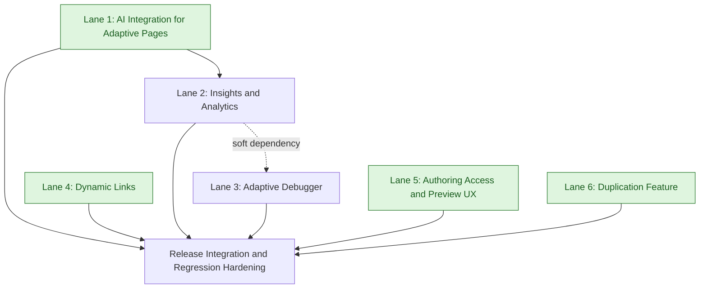

# Adaptive Page Improvements — High-Level Development Plan

Context references:
- Epic overview: `docs/epics/adaptive_page_improvements/overview.md`
- Feature informals:
  - `docs/epics/adaptive_page_improvements/adaptive_context/informal.md`
  - `docs/epics/adaptive_page_improvements/adaptive_duplication/informal.md`
  - `docs/epics/adaptive_page_improvements/adaptive_triggers/informal.md`
  - `docs/epics/adaptive_page_improvements/dynamic_links/informal.md`
  - `docs/epics/adaptive_page_improvements/iframe_links/informal.md`
  - `docs/epics/adaptive_page_improvements/llm_feedback/informal.md`
  - `docs/epics/adaptive_page_improvements/override_dot/informal.md`
  - `docs/epics/adaptive_page_improvements/student_responses/informal.md`
  - `docs/epics/adaptive_page_improvements/trap_state_triggers/informal.md`

## Why We Are Organizing By Lanes

Lanes exist to better organize related work so that one engineer can work a cohesive group of related items end-to-end. This should reduce context switching, improve consistency across related tickets, and increase quality through focused attention in one functional area.

## Lane Summary

- Lane 1: AI Integration for Adaptive Pages
  - Builds adaptive AI controls, activation points, trap-state triggers, page-context awareness, and LLM-driven feedback behaviors.
- Lane 2: Insights and Analytics
  - Establishes adaptive rendering and data/aggregation correctness so instructor and author analytics are reliable and screen-granular.
- Lane 3: Adaptive Debugger
  - Improves debugger usability and analysis quality via access improvements, sorting fixes, and richer response/state detail panes.
- Lane 4: Dynamic Links
  - Adds adaptive internal linking plus iframe dynamic-source support using shared resource-id link structures and rewrite pipelines.
- Lane 5: Authoring Access and Preview UX
  - Streamlines adaptive authoring entry, read-only/edit transitions, curriculum options/preview flows, and related UX polish.
- Lane 6: Duplication Feature
  - Delivers adaptive page duplication with correct activity/resource copying and internal reference remapping.

## Clarifications and Assumptions

- This plan is intentionally high-level and lane-oriented.
- Jira scope and ticket descriptions were revalidated from Jira for epic `MER-5200` on February 16, 2026.
- Excluded from planning scope: `MER-4584` (status: Closed Won't Do).
- Serial order within each lane is dependency-first, then risk reduction, then delivery flow.
- Feature slugs with local `informal.md` docs are paired as source-of-truth for technical depth; non-feature tickets use Jira descriptions directly.

## Lane 1: AI Integration for Adaptive Pages

### Scope
- MER-4943 `override_dot`
- MER-4945 `adaptive_triggers`
- MER-4946 `trap_state_triggers`
- MER-4944 `adaptive_context`
- MER-4961 `llm_feedback`

### Proposed Serial Order
1. MER-4943 Enable/Disable DOT on a Page Level
2. MER-4945 Add Screen-Level AI Activation Points for Adaptive Pages
3. MER-4946 Add Trap State Activation Point in Advanced Author
4. MER-4944 Make DOT Aware of Adaptive Page Progression
5. MER-4961 Enable LLM-Generated Feedback Based on Student Responses

### Dependency Notes
- MER-4961 strictly depends on MER-4946 (explicit in informal guidance).
- MER-4943 provides foundational AI-on/off controls and defaults used by the rest of AI behavior.
- MER-4945 and MER-4946 both extend adaptive trigger infrastructure (screen-level and trap-state level); doing MER-4945 first de-risks shared activation plumbing.
- MER-4944 is best landed before MER-4961 so generated/help responses have robust adaptive context.

### Cross-Lane Dependencies
- Optional dependency on Insights lane (MER-5052) for shared response-shaping logic validation, but not a hard blocker for this lane.

## Lane 2: Insights and Analytics

### Scope
- MER-5049 Enable Adaptive Page Rendering in Instructor Insights and Analytics
- MER-5053 Aggregate Authoring Insights Data to Show One Row per Screen
- MER-5054 Align Adaptive Practice Page Analytics with Scored Adaptive Pages - Authoring Insights
- MER-5052 `student_responses`

### Proposed Serial Order
1. MER-5049 Enable Adaptive Page Rendering in Instructor Insights and Analytics
2. MER-5053 Aggregate Authoring Insights Data to Show One Row per Screen
3. MER-5054 Align Adaptive Practice Page Analytics with Scored Adaptive Pages
4. MER-5052 Display Student Responses for Adaptive Pages in Instructor Insights and Analytics

### Dependency Notes
- MER-5049 is a UI/rendering prerequisite for adaptive visibility in Insights.
- MER-5053 and MER-5054 establish and normalize analytics aggregation semantics at screen granularity.
- MER-5052 depends on both rendering readiness (MER-5049) and confidence in response/summary pipeline behavior (MER-5053/MER-5054 plus the `student_responses` informal guidance).

### Cross-Lane Dependencies
- Debugger lane MER-5214 can reuse response display decisions from MER-5052.

## Lane 3: Adaptive Debugger

### Scope
- MER-4744 Easier Access to the Adaptive Debugger
- MER-5215 Adaptive Debugger Functionality - Fix Sorting
- MER-5214 Show Student Responses and Improve Adaptive Debugger Detail Pane

### Proposed Serial Order
1. MER-4744 Easier Access to the Adaptive Debugger
2. MER-5215 Adaptive Debugger Functionality - Fix Sorting (Especially by Date Evaluated)
3. MER-5214 Show Student Responses and Improve Adaptive Debugger Detail Pane

### Dependency Notes
- MER-4744 first improves discoverability and usage of debugger workflows.
- MER-5215 is a stabilizing bug fix and should land before larger debugger detail-pane enhancements.
- MER-5214 builds on stable debugger behavior and may share response rendering patterns with Insights work.

### Cross-Lane Dependencies
- Soft dependency on Insights lane MER-5052 for common student-response formatting and data shaping patterns.

## Lane 4: Dynamic Links

### Scope
- MER-5211 `dynamic_links`
- MER-5212 `iframe_links`

### Proposed Serial Order
1. MER-5211 Enable In-Text Dynamic Linking Within Adaptive Pages
2. MER-5212 Support Dynamic Links as iFrame Sources in Adaptive Pages

### Dependency Notes
- MER-5212 explicitly depends on MER-5211 per technical guidance.
- MER-5211 establishes link structure (`resource_id`-based), import rewrite behavior, and delivery-time URL rewriting needed by MER-5212.

### Cross-Lane Dependencies
- No hard cross-lane dependency expected.

## Lane 5: Authoring Access and Preview UX

### Scope
- MER-5234 Streamlining Adaptive Page Access
- MER-5235 Separate Advanced and Simple Author Page Creation Options
- MER-5220 Curriculum: Direct page previewing and icon changes
- MER-5213 Update Preview Behavior to Open Current Screen in Adaptive Authoring
- MER-5107 Reposition Support and Cookies on Adaptive Page Not Full Screen

### Proposed Serial Order
1. MER-5234 Streamlining Adaptive Page Access
2. MER-5235 Separate Advanced and Simple Author Page Creation Options
3. MER-5220 Curriculum: Direct page previewing and icon changes
4. MER-5213 Update Preview Behavior to Open Current Screen in Adaptive Authoring
5. MER-5107 Reposition Support and Cookies on Adaptive Page Not Full Screen

### Dependency Notes
- MER-5234 introduces read-only-first authoring entry and toggle behavior that is reused by creation-flow routing decisions in MER-5235.
- MER-5235 should follow MER-5234 to avoid routing to flows that do not yet support the expected read-only destination.
- MER-5220 builds on the same curriculum options surface and introduces preview entry points; sequencing it after MER-5234/MER-5235 reduces UX churn.
- MER-5213 should follow MER-5220 because both touch preview behavior, and MER-5213 refines where preview lands (current screen).
- MER-5107 is mostly layout positioning and can move earlier if needed; it is listed last as lowest technical coupling/risk.

### Cross-Lane Dependencies
- Minimal technical coupling to other lanes; primarily shared UI surfaces in curriculum/authoring.

## Lane 6: Duplication Feature

### Scope
- MER-4082 Ability to duplicate adaptive pages in a project (`adaptive_duplication`)

### Proposed Serial Order
1. MER-4082 Ability to duplicate adaptive pages in a project

### Dependency Notes
- Independent authoring/resource-copy workflow with internal-reference rewriting and feature flagging.

### Cross-Lane Dependencies
- No hard cross-lane dependency expected.

## Suggested Global Execution Shape

1. Start Lane 1 (AI Integration) and Lane 4 (Dynamic Links) first because they contain explicit internal dependencies and high technical coupling.
2. Run Lane 2 (Insights/Analytics) in parallel after baseline adaptive rendering path is stable.
3. Run Lane 3 (Debugger) as a parallel UX/quality track, sequencing response-heavy debugger improvements after response modeling decisions in Lane 2.
4. Start Lane 5 (Authoring Access/Preview UX) as a parallel UI stream once routing/read-only decisions are staffed.
5. Run Lane 6 (Duplication Feature) opportunistically based on staffing and release windows.

## Lane Dependency Flow (Mermaid)

Note: Light green lane nodes indicate lanes with no inbound dependencies and can be started immediately.
