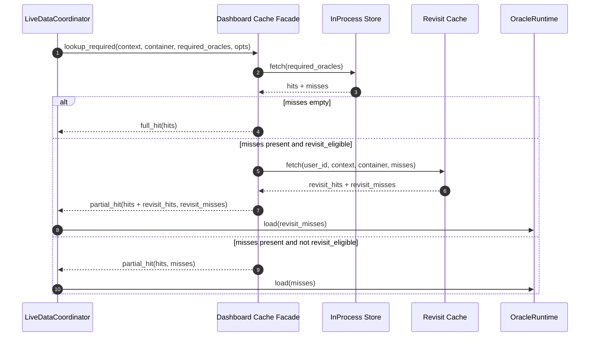
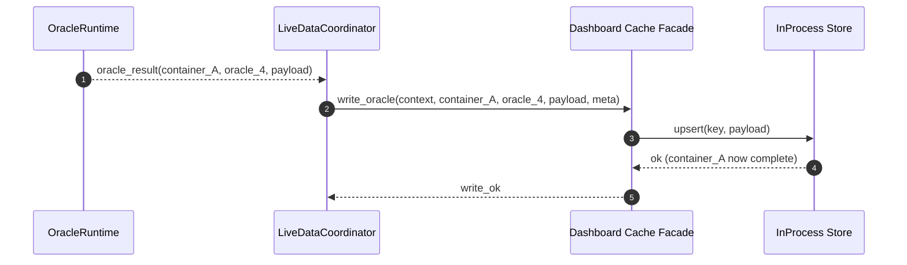
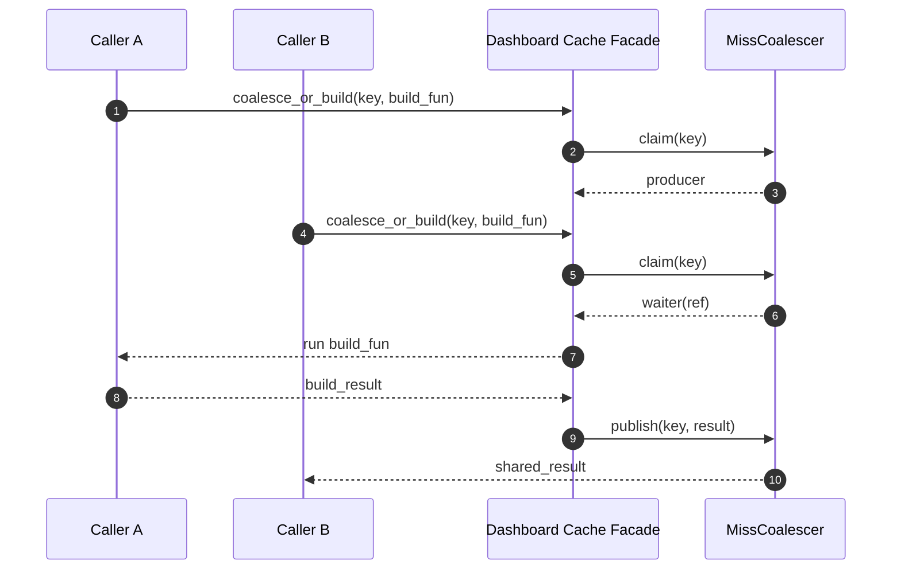

# Data Cache FDD

Last updated: 2026-02-17
Feature: `data_cache`
Epic: `MER-5198`
Primary Jira: `MER-5303`

## 1. Executive Summary

This feature implements the storage and caching policy layer for Intelligent Dashboard oracle payloads. It provides two cache tiers: in-process session cache for rapid scope interaction and node-wide revisit cache for short-lived return flows. The design uses deterministic oracle-level keys that include context, container, oracle identity, and version metadata. It enforces TTL freshness and enrollment-tiered container LRU capacity bounds to keep memory predictable. It supports partial container completeness so callers can hydrate cached required payloads while loading only missing dependencies. It supports late oracle writes so previous container payloads can become complete even after user navigation moves to another container. It provides miss coalescing for identical keys to reduce duplicate build work under concurrent demand. The cache layer exposes a stable API consumed by coordinator/read-through orchestration. It explicitly does not implement queue/token stale suppression policy, which remains coordinator-owned.

## 2. Requirements & Assumptions

Functional requirements (PRD mapping):
- FR-001, FR-002: deterministic in-process and revisit keying.
- FR-003, FR-004: TTL and enrollment-tiered capacity/LRU policy.
- FR-005, FR-006: oracle-granular writes and partial-hit semantics.
- FR-007: per-key miss coalescing.
- FR-008: strict revisit eligibility on explicit-container return flows.
- FR-009, FR-010: clear boundary where cache is used by coordinator but does not own queue/token policy.
- FR-011: extensive unit testing with mocked/stubbed concrete dependencies for cache boundary interaction coverage.

Non-functional targets:
- Per-key lookup p95 <= 5ms.
- Required-set lookup p95 <= 20ms.
- No cross-user revisit leakage.

Explicit assumptions:
- Coordinator and snapshot layers will call cache via public facade functions only.
- Revisit cache remains node-local in baseline.
- Oracle `version` and `data_version` metadata are available for key composition.

Assumption risks:
- If version metadata is inconsistent across oracles, stale/collision behavior risk increases.
- Node-local revisit scope may reduce hit rate in some multi-node navigation paths.

## 3. Torus Context Summary

What we know:
- `docs/epics/intelligent_dashboard/data_cache/prd.md` defines key shapes, TTL defaults, tiered capacity env vars, late-write requirements, and strict revisit policy.
- `docs/epics/intelligent_dashboard/edd.md` positions cache as reusable `Oli.Dashboard.*` infrastructure consumed by coordinator/runtime flows.
- Existing Torus system includes cache/depot patterns and telemetry conventions that fit this design.
- Prototype validates a minimal, effective in-process cache shape:
  - key by normalized scope fields + oracle key (`lib/oli/instructor_dashboard/prototype/in_process_cache.ex`).
  - coordinator/controller performs read-through orchestration and cache writes (`lib/oli/instructor_dashboard/prototype/live_data_controller.ex`).

Unknowns to confirm:
- Final implementation choice for in-process backing store (LiveView-owned map vs ETS-backed structure).
- Whether revisit coalescing scope should remain purely node-local after initial rollout metrics.

## 4. Proposed Design

### 4.1 Component Roles & Interactions

Core components:
- `Oli.Dashboard.Cache` (facade)
  - Public API consumed by coordinator/snapshot layers.
  - Dispatches to in-process and revisit stores.
- `Oli.Dashboard.Cache.Key`
  - Canonical key construction/parsing and identity guards.
- `Oli.Dashboard.Cache.InProcessStore`
  - Session-local oracle payload store by scope + oracle identity.
  - Tracks container recency for LRU.
- `Oli.Dashboard.RevisitCache`
  - Node-wide per-user short-lived store for eligible return flows.
- `Oli.Dashboard.Cache.MissCoalescer`
  - Producer/waiter coordination for identical missing keys.
- `Oli.Dashboard.Cache.Policy`
  - TTL evaluation and enrollment-tiered capacity calculations.

Boundary rule:
- Coordinator calls cache facade APIs.
- Cache layer contains no coordinator queue/token transition logic.
- Prototype-confirmed separation: cache module has only `new/fetch/put`; orchestration stays controller-owned.

### 4.2 State & Message Flow

Read-through behavior with strict revisit policy:



Late completion + container return behavior:



Miss coalescing behavior:



### 4.3 Supervision & Lifecycle

- In-process cache lifecycle is tied to LiveView/session lifecycle.
- Revisit cache is node-scoped and supervised as shared process/storage service.
- Miss coalescer lifecycle follows cache process lifecycle.
- Cache failures degrade to load path (coordinator/runtime) rather than session crash.

### 4.4 Alternatives Considered

- Container-blob cache entries only.
  - Rejected because partial and late completion benefits are lost.
- Unlimited container retention.
  - Rejected due to memory pressure risks.
- Embedding queue/token policy inside cache.
  - Rejected due to boundary violation and mixed responsibilities.

## 5. Interfaces

### 5.1 HTTP/JSON APIs

No direct HTTP/JSON APIs.

### 5.2 LiveView

No direct LiveView callbacks in cache layer.

LiveView integration occurs indirectly through coordinator/snapshot callers that consume cache facade results:
- `%{hits: ..., misses: ...}` for required lookups
- deterministic cache errors that trigger runtime fallback

### 5.3 Processes

Notional cache facade API:

```elixir
lookup_required(context, container, required_oracles, opts) ::
  {:ok, %{hits: %{atom() => map()}, misses: [atom()], source: atom()}} | {:error, term()}

lookup_revisit(user_id, context, container, oracle_keys, opts) ::
  {:ok, %{hits: %{atom() => map()}, misses: [atom()]}} | {:error, term()}

write_oracle(context, container, oracle_key, payload, meta, opts) :: :ok | {:error, term()}

touch_container(context, container, opts) :: :ok

coalesce_or_build(cache_key, build_fun, opts) :: {:ok, map()} | {:error, term()}
```

Required metadata in `meta`:
- `oracle_version`
- `data_version`
- `container_type`
- `dashboard_context_id`
- optional `user_id` for revisit writes

## 6. Data Model & Storage

### 6.1 Ecto Schemas

None.

### 6.2 Query Performance

Cache layer does not execute analytics queries.

Performance-sensitive operations:
- key construction/parsing,
- lookup and TTL checks,
- LRU recency updates,
- eviction sweeps,
- coalescing synchronization.

## 7. Consistency & Transactions

- Cache writes are non-transactional but identity-guarded.
- Identity guard requires context/container/oracle/version coherence.
- Partial completeness is first-class: no all-or-nothing container barrier.
- Revisit entries must remain strictly user-scoped.

## 8. Caching Strategy

Key strategy:
- In-process: `{:dashboard_oracle, oracle_key, dashboard_context_id, container_type, container_id_or_nil, oracle_version, data_version}`.
- Revisit: `{:dashboard_revisit_oracle, user_id, dashboard_context_id, container_type, container_id_or_nil, oracle_key, oracle_version, data_version}`.

Freshness and capacity:
- `INSTRUCTOR_DASHBOARD_INPROCESS_CACHE_TTL_MINUTES` (default `15`).
- `INSTRUCTOR_DASHBOARD_REVISIT_CACHE_TTL_MINUTES` (default `5`).
- Enrollment-tiered max containers with container-scoped LRU eviction:
  - small threshold and max
  - normal threshold and max
  - large max

Lookup order:
- Normal flow: `InProcess -> build/load`.
- Revisit-eligible flow: `InProcess -> Revisit -> build/load`.

Prototype alignment notes:
- Scope filters are part of cache identity in prototype and should remain part of canonical scope key semantics.
- TTL/LRU/revisit/coalescing are production additions beyond prototype and should be implemented in cache layer without moving orchestration into coordinator.

## 9. Performance and Scalability Plan

### 9.1 Budgets

- Single-key lookup p95 <= 5ms, p99 <= 10ms.
- Required-set lookup p95 <= 20ms.
- Eviction operation p95 <= 10ms per container eviction event.

### 9.2 Hotspots & Mitigations

- Hotspot: large sections with many containers.
  - Mitigation: enrollment-tiered container caps + container LRU eviction.
- Hotspot: repeated concurrent misses for same oracle key.
  - Mitigation: miss coalescing producer/waiter model.
- Hotspot: revisit overuse causing stale perception.
  - Mitigation: short revisit TTL + strict eligibility rules.

## 10. Failure Modes & Resilience

| Failure mode | Detection | Handling |
|---|---|---|
| In-process cache unavailable | facade error | return miss/fallback signal to caller |
| Revisit cache unavailable | revisit read error | continue with in-process + load path |
| TTL expired entry | lookup expiry check | treat as miss and rebuild |
| Identity mismatch on write | guard validation failure | reject write and emit telemetry |
| Coalescing failure | claim/publish error | degrade to non-coalesced build path with telemetry |

## 11. Observability

Telemetry events (proposed):
- `[:oli, :dashboard, :cache, :lookup, :stop]`
- `[:oli, :dashboard, :cache, :revisit_lookup, :stop]`
- `[:oli, :dashboard, :cache, :write, :stop]`
- `[:oli, :dashboard, :cache, :eviction, :container]`
- `[:oli, :dashboard, :cache, :ttl_expired]`
- `[:oli, :dashboard, :cache, :coalescing, :claim]`

Metadata:
- `cache_tier` (`inprocess`, `revisit`)
- `oracle_key`
- `container_type`
- `outcome` (`hit`, `miss`, `error`, `expired`, `coalesced_waiter`, `coalesced_producer`)

## 12. Security & Privacy

- Revisit keys and payload access are strictly user-scoped.
- No raw payload logging for student-sensitive data.
- Cache facade enforces context identity to prevent cross-context leakage.
- No new persistence of sensitive data beyond bounded cache retention windows.

## 13. Testing Strategy

Unit tests:
- key build/parse and identity guard checks
- TTL behavior and expiry handling
- tier capacity computation and LRU eviction correctness
- revisit eligibility checks
- mocked/stubbed oracle payload producers/coalescing participants where needed to exercise end-to-end cache component interactions at boundaries

Integration tests:
- read-through lookup ordering and partial-hit behavior
- late oracle completion write behavior
- cross-user revisit isolation

Concurrency tests:
- miss coalescing producer/waiter correctness
- fallback behavior when coalescer path fails

## 14. Backwards Compatibility

- Additive infrastructure.
- Callers can migrate incrementally from direct load paths to cache read-through APIs.
- No schema or public end-user API changes.

## 15. Risks & Mitigations

- Risk: cache policy drift between docs and implementation.
  - Mitigation: centralized cache facade + policy module + contract tests.
- Risk: hidden coupling to coordinator internals.
  - Mitigation: explicit API boundary and non-goal prohibition.
- Risk: low revisit hit rates reduce practical benefit.
  - Mitigation: monitor metrics and tune eligibility/TTL with production data.

## 16. Open Questions & Follow-ups

- Should revisit cache become optionally distributed across nodes in a later phase?
- Should per-oracle TTL override support be introduced after baseline metrics are collected?

## 17. Decision Log

### 2026-02-17 - Capture Prototype Baseline for Cache Identity and Orchestration Split
- Change: Updated FDD language to explicitly anchor baseline cache identity on scope+oracle key and preserve cache-only storage responsibilities.
- Reason: Prototype proved read-through value with minimal cache APIs and clear controller/cache responsibility boundaries.
- Evidence: `lib/oli/instructor_dashboard/prototype/in_process_cache.ex`, `lib/oli/instructor_dashboard/prototype/live_data_controller.ex`
- Impact: Clarifies `FR-001`/`FR-006`/`FR-010` implementation boundaries and prevents policy leakage into coordinator.

## 18. References

- `docs/epics/intelligent_dashboard/data_cache/prd.md`
- `docs/epics/intelligent_dashboard/edd.md`
- `docs/epics/intelligent_dashboard/data_coordinator/prd.md`
- `lib/oli/instructor_dashboard/prototype/in_process_cache.ex`
- `lib/oli/instructor_dashboard/prototype/live_data_controller.ex`
- `lib/oli/instructor_dashboard/prototype/scope.ex`
