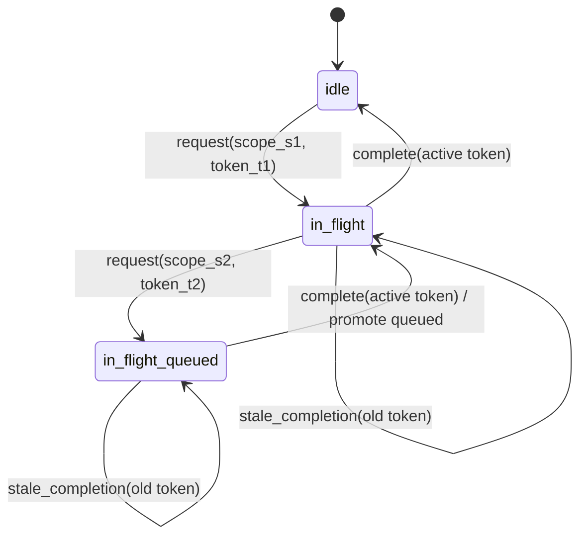
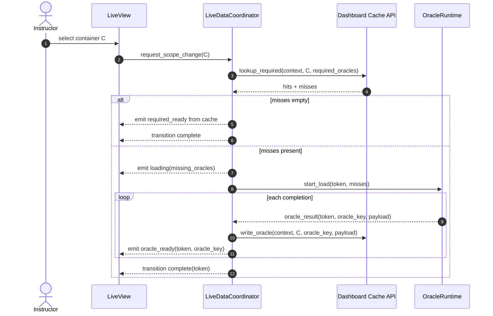
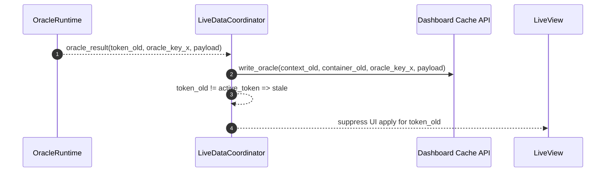

# Data Coordinator FDD

Last updated: 2026-02-17
Feature: `data_coordinator`
Epic: `MER-5198`
Primary Jira: `MER-5302`

## 1. Executive Summary

This feature implements the runtime orchestration layer that controls scoped dashboard loads for a single LiveView session. The coordinator enforces one active request plus one replaceable queued request to bound backend work during rapid scope changes. It preserves latest-intent behavior and prevents stale results from mutating UI state through mandatory token guards. It emits incremental readiness and failure events so tiles can hydrate without waiting for global completion. The coordinator integrates cache-aware read-through behavior, but only through a stable cache API boundary. Cache keying, TTL, eviction, revisit retention, and coalescing policy stay outside coordinator scope. The design explicitly allows stale completions to warm cache for earlier containers while still suppressing stale UI mutation. State transitions are deterministic and testable with pure transition functions and action outputs. Operationally, the design emphasizes telemetry around queue behavior, stale discards, cache consult outcomes, and request latency.

## 2. Requirements & Assumptions

Functional requirements (PRD mapping):
- FR-001, FR-002: one in-flight + one replaceable queued request.
- FR-003: tokenized stale-result suppression at UI apply boundaries.
- FR-004: incremental readiness/failure emissions.
- FR-005, FR-006: cache consult-first and cache-write-on-completion integration.
- FR-007, FR-010: strict boundary where coordinator uses cache API and avoids cache policy internals.
- FR-008, FR-009: observability and deterministic transition semantics.
- FR-011: extensive unit testing with mocked/stubbed dependencies for coordinator boundary interactions.
- FR-012: configurable hard timeout with deterministic timeout fallback handling and continued request responsiveness.

Non-functional targets:
- LiveView scope-change transition handling p95 <= 100ms.
- Coordinator transition overhead p95 <= 25ms.
- Zero stale UI updates in regression suites.

Explicit assumptions:
- Oracle dependency profile resolution is available from `MER-5301`.
- Cache facade APIs from `MER-5303` expose deterministic `hits/misses` semantics.
- Coordinator remains session-scoped (no new global scheduler process in baseline).

Assumption risks:
- If cache API contracts drift, coordinator action model may need refactoring.
- If request volume exceeds one-queue design assumptions, starvation tuning may be needed.

## 3. Torus Context Summary

What we know:
- `docs/epics/intelligent_dashboard/data_coordinator/prd.md` defines required rapid-filter policy, timeout fallback behavior, and stale suppression semantics.
- `docs/epics/intelligent_dashboard/edd.md` positions `Oli.Dashboard.LiveDataCoordinator` as runtime orchestrator between LiveView, runtime, and cache.
- Existing instructor dashboard LiveView paths already perform asynchronous loading and message-based updates (`lib/oli_web/live/delivery/instructor_dashboard/instructor_dashboard_live.ex`), making a session-scoped coordinator fit the platform model.
- Existing telemetry style uses structured `:telemetry.execute` with AppSignal mapping, which this feature follows.
- Prototype `LiveDataController` already demonstrates coordinator-fit orchestration:
  - resolve tile dependencies, read cache first, load misses, write-through cache, then project (`lib/oli/instructor_dashboard/prototype/live_data_controller.ex`).
  - expose per-oracle source metadata (`:cache`, `:loaded`, `:skipped_optional`) to support observability and incremental UX.

Unknowns to confirm:
- Final action/event naming conventions shared with `MER-5304` snapshot assembly integration.
- Whether cooperative cancellation should be introduced in the same milestone or follow-up.

## 4. Proposed Design

### 4.1 Component Roles & Interactions

Core components:
- `Oli.Dashboard.LiveDataCoordinator`
  - Owns request-control state machine and token guards.
  - Emits actions: cache lookup, runtime load start, UI events, cache writes.
- `Oli.Dashboard.LiveDataCoordinator.State`
  - Pure state struct and transition helpers.
- `Oli.Dashboard.LiveDataCoordinator.Actions`
  - Action envelope consumed by integration layer.
- `Oli.Dashboard.Cache` (external dependency)
  - Provides cache lookup/write behavior via public API.
- `Oli.Dashboard.OracleRuntime` (external dependency)
  - Performs oracle execution for missing dependencies.

Boundary contract:
- Coordinator depends on cache facade and runtime facade only.
- Coordinator does not build cache keys or implement TTL/LRU/revisit/coalescing policy.
- Cache does not own coordinator queue/token state.
- Prototype-validated baseline orchestration order: `resolve_oracles -> cache lookup -> load misses -> cache write -> snapshot.project`.

### 4.2 State & Message Flow

Coordinator state machine:



Scope-change flow with cache boundary:



Prototype alignment notes:
- `load/2` in prototype returns both snapshot and orchestration metadata, including oracle source counts. Production should keep equivalent metadata on emitted events/telemetry.
- Optional oracle deferral is represented with deterministic `:skipped_optional` status and should map to tile-level readiness semantics.

Stale completion behavior:



### 4.3 Supervision & Lifecycle

- No new global long-lived coordinator process in baseline.
- Coordinator state is session-scoped and owned by LiveView assigns (or equivalent request-scoped state holder).
- Oracle runtime tasks remain externally supervised by runtime layer.
- On LiveView terminate, coordinator state and queue are dropped.

### 4.4 Alternatives Considered

- Unbounded concurrent request execution.
  - Rejected due to fan-out amplification and stale race risk.
- Cache-owning orchestration logic.
  - Rejected due to mixed responsibilities and poor boundary clarity.
- Debounce-only approach.
  - Rejected because it cannot guarantee bounded work and deterministic stale suppression.

## 5. Interfaces

### 5.1 HTTP/JSON APIs

No direct HTTP/JSON API changes.

### 5.2 LiveView

Expected integration points:
- `handle_params/3` or event handlers trigger `request_scope_change`.
- `handle_info/2` consumes runtime completion messages.
- Assigns touched:
  - coordinator state
  - per-tile readiness/error states
  - current active token metadata

Integration guardrails:
- All apply paths must pass through token checks.
- LiveView should treat coordinator actions as authoritative transition outputs.

### 5.3 Processes

Notional coordinator API:

```elixir
@type action ::
  {:cache_lookup, scope(), [oracle_key()]} |
  {:runtime_start, request_token(), [oracle_key()]} |
  {:emit_loading, request_token(), [oracle_key()]} |
  {:emit_ready, request_token(), oracle_key()} |
  {:emit_failure, request_token(), oracle_key(), term()} |
  {:cache_write, scope(), oracle_key(), map()} |
  {:promote_queued, scope(), request_token()} |
  {:complete, request_token()}

new_session(opts) :: state()
request_scope_change(state(), scope(), dependency_profile()) :: {state(), [action()]}
handle_oracle_result(state(), request_token(), oracle_key(), oracle_result()) :: {state(), [action()]}
```

Required cache facade calls (coordinator dependency only):
- `lookup_required/4`
- `lookup_revisit/4`
- `write_oracle/6`
- `touch_container/3`

## 6. Data Model & Storage

### 6.1 Ecto Schemas

None.

### 6.2 Query Performance

Coordinator performs no direct analytics queries.

Performance impact is orchestration-only:
- transition logic,
- cache API call dispatch,
- runtime job scheduling,
- UI event emission.

## 7. Consistency & Transactions

- No DB transactions introduced.
- Consistency model is token-based state application ordering.
- Stale completion policy:
  - cache warming is allowed when identity checks pass,
  - UI mutation for stale token is forbidden.

## 8. Caching Strategy

Coordinator cache posture:
- Uses cache as read-through dependency.
- Accepts `hits/misses` and decides runtime launch for misses.
- Writes per-oracle completion via cache API.

Coordinator exclusions:
- no cache key construction
- no TTL checks
- no LRU bookkeeping
- no revisit retention decisions
- no miss coalescing algorithm ownership

## 9. Performance and Scalability Plan

### 9.1 Budgets

- LiveView scope-change transition handling p95 <= 100ms, p99 <= 150ms.
- Coordinator transition logic p95 <= 25ms.
- Time-to-first-required-ready (warm path) p95 <= 150ms.

### 9.2 Hotspots & Mitigations

- Hotspot: rapid scope thrash causes queue replacement churn.
  - Mitigation: one active + one queued with replacement-only semantics.
- Hotspot: stale completion storms.
  - Mitigation: constant-time token mismatch discard path for UI apply.
- Hotspot: repeated partial misses for same keys.
  - Mitigation: rely on cache miss coalescing API in `MER-5303`.

## 10. Failure Modes & Resilience

| Failure mode | Detection | Handling |
|---|---|---|
| Stale token completion | token mismatch | write cache if identity-valid; suppress UI apply |
| Runtime oracle failure | completion error envelope | emit scoped dependency failure state |
| Cache lookup failure | cache API error | fallback to runtime load for required dependencies |
| Cache write failure | cache API error | continue UI flow; emit telemetry for degraded cache path |
| Active scope build timeout | timeout threshold exceeded | emit deterministic timeout fallback event/state for active token, preserve coordinator liveness, allow next request processing |
| Invalid coordinator transition | transition guard failure | return deterministic internal error action and preserve state integrity |

## 11. Observability

Telemetry events (proposed):
- `[:oli, :dashboard, :coordinator, :request, :started]`
- `[:oli, :dashboard, :coordinator, :request, :queued]`
- `[:oli, :dashboard, :coordinator, :request, :queue_replaced]`
- `[:oli, :dashboard, :coordinator, :request, :stale_discarded]`
- `[:oli, :dashboard, :coordinator, :request, :timeout]`
- `[:oli, :dashboard, :coordinator, :cache, :consult]`
- `[:oli, :dashboard, :coordinator, :request, :completed]`

Key metadata:
- `dashboard_product`, `dashboard_context_type`, `scope_container_type`
- `token_state` (`active`, `queued`, `stale`)
- `cache_outcome` (`full_hit`, `partial_hit`, `miss`, `error`)

## 12. Security & Privacy

- Coordinator holds scoped identifiers only; no new PII persistence.
- Telemetry excludes payload bodies and student-level sensitive fields.
- Authorization enforcement remains upstream of coordinator entry points.

## 13. Testing Strategy

Unit tests:
- state transitions and queue replacement behavior
- stale token suppression
- invalid event transition handling
- mocked/stubbed cache facade and oracle-result producers where needed to test end-to-end coordinator component interactions at boundaries

Integration tests:
- rapid A/B/C scope cycling and latest-intent outcomes
- cache partial-hit + runtime miss load integration
- stale completion cache-write plus UI suppression
- active request timeout produces deterministic fallback state and preserves subsequent request handling

LiveView tests:
- incremental hydration ordering
- no stale assigns mutation across concurrent completions

## 14. Backwards Compatibility

- Additive orchestration layer.
- Existing async paths can be migrated incrementally to coordinator action model.
- No schema/API break for end users.

## 15. Risks & Mitigations

- Risk: hidden apply paths bypass token guard.
  - Mitigation: centralize apply helper and cover with integration tests.
- Risk: coordinator absorbs cache policy logic over time.
  - Mitigation: enforce boundary in docs, code review checklist, and API contracts.
- Risk: queue policy negatively impacts perceived responsiveness for intermediate selections.
  - Mitigation: latest-intent is explicit product policy; monitor and tune if needed.

## 16. Open Questions & Follow-ups

- Should cooperative cancellation be enabled after baseline stability (to reduce wasted runtime work)?
- Should optional short debounce be introduced only when queue replacement rate exceeds threshold?

## 17. Decision Log

### 2026-02-17 - Align Coordinator FDD With Prototype LiveDataController Flow
- Change: Added explicit prototype-backed orchestration sequence and metadata expectations for oracle source attribution.
- Reason: Prototype validated that read-through orchestration and source tagging are central to incremental hydration and cache observability.
- Evidence: `lib/oli/instructor_dashboard/prototype/live_data_controller.ex`, `lib/oli/instructor_dashboard/prototype/snapshot.ex`
- Impact: Tightens `FR-004`/`FR-005`/`FR-008` implementation details without changing queue/token acceptance outcomes.

## 18. References

- `docs/epics/intelligent_dashboard/data_coordinator/prd.md`
- `docs/epics/intelligent_dashboard/edd.md`
- `docs/epics/intelligent_dashboard/data_cache/prd.md`
- `lib/oli_web/live/delivery/instructor_dashboard/instructor_dashboard_live.ex`
- `lib/oli/instructor_dashboard/prototype/live_data_controller.ex`
- `lib/oli/instructor_dashboard/prototype/snapshot.ex`
- `lib/oli/instructor_dashboard/prototype/tile_registry.ex`
