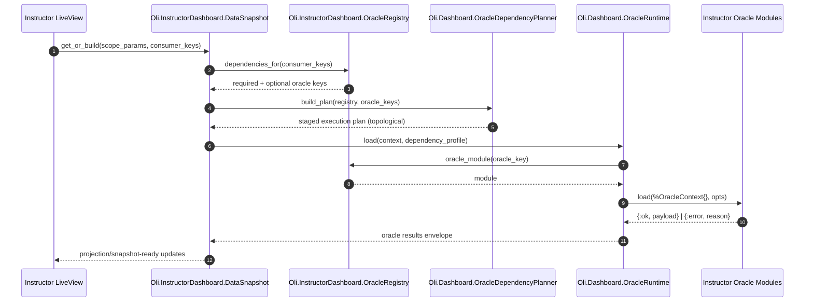
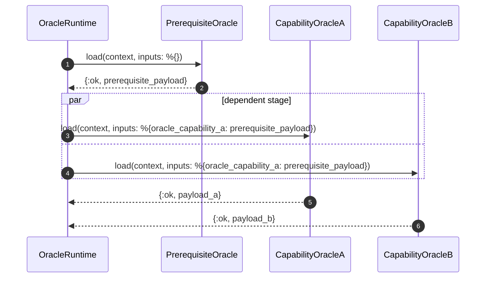
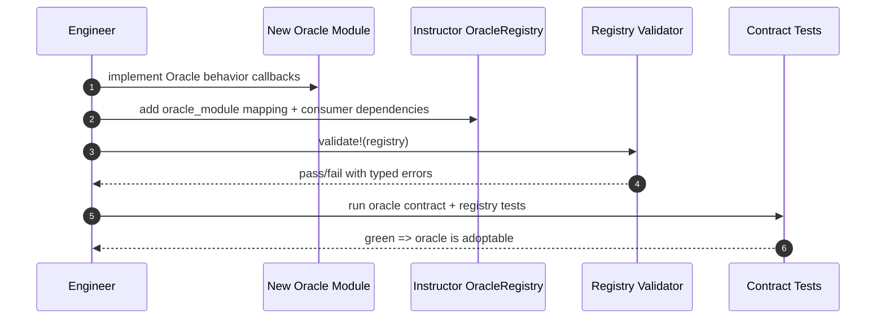

# Data Oracles FDD

Last updated: 2026-02-17
Feature: `data_oracles`
Epic: `MER-5198`
Primary Jira: `MER-5301`

## 1. Executive Summary

This design introduces the contract foundation for Intelligent Dashboard data access and makes oracle modules the only sanctioned query boundary for dashboard consumers. It defines reusable shared interfaces in `Oli.Dashboard.*` and separates product-specific dependency composition into `Oli.InstructorDashboard.*`. The shared layer standardizes scope normalization, oracle request context, oracle behavior callbacks, and registry behavior. The instructor layer provides capability-oriented dependency profiles and binding scaffolds, while exact concrete instructor oracle modules/keys remain tile-driven and are finalized in tile implementation stories. The immediate objective is to eliminate tile-local and LiveView-local analytics query patterns for covered domains. This design intentionally keeps coordinator, cache, and snapshot responsibilities out of this slice so downstream stories can build on stable contracts without redefinition. Runtime behavior is deterministic through typed validation errors for invalid consumer keys and missing oracle mappings. The performance posture treats registry operations as in-memory lookups with strict latency budgets. The main risk is partial adoption that leaves direct query bypasses, so migration checks and integration tests are first-class outputs of this design.

## 2. Requirements & Assumptions

Functional requirements (mapped to PRD):
- FR-001, FR-002: canonical `Scope` and `OracleContext` contracts.
- FR-003, FR-004: shared `Oracle` and `OracleRegistry` behaviors.
- FR-005, FR-010: explicit instructor specialization via `Oli.InstructorDashboard.OracleRegistry` and capability-to-oracle binding scaffolds.
- FR-006, FR-008: datastore encapsulation and no direct-query bypass for covered domains.
- FR-007, FR-011, FR-012: deterministic dependency/module resolution, prerequisite planning, and profile introspection.
- FR-013: extensive unit testing requirement, including mocked/stubbed concrete-oracle test doubles for boundary interaction coverage.

Non-functional targets:
- Registry dependency resolution p95 <= 10ms, p99 <= 20ms.
- Registry oracle-module lookup p95 <= 2ms, p99 <= 5ms.
- Validation overhead p95 <= 2ms.
- Deterministic typed errors for declaration and lookup failures.

Explicit assumptions:
- `Oli.Dashboard.*` namespace is available for new shared infrastructure modules.
- Existing instructor analytics code paths can be migrated incrementally without large route-level rewrites.
- ClickHouse-first aggregate strategy remains oracle-internal and unchanged by this contract layer.

Assumption risks:
- If namespace collisions appear, module placement may need adjustment.
- If legacy query paths are tightly coupled to UI assigns, migration could require an interim adapter layer.

## 3. Torus Context Summary

What we know:
- Epic architecture already defines shared `Oli.Dashboard.*` foundation and instructor composition layer (`docs/epics/intelligent_dashboard/edd.md`).
- `docs/epics/intelligent_dashboard/data_oracles/prd.md` defines oracle contract intent, `OracleContext`, no-oracle-to-oracle direct-calling rule, and dependency-driven consumer hydration.
- Current instructor dashboard code still contains direct analytics query helpers in `lib/oli_web/components/delivery/instructor_dashboard/section_analytics.ex` and call sites in `lib/oli_web/live/delivery/instructor_dashboard/instructor_dashboard_live.ex`.
- Existing section hierarchy/container lookups are available via `lib/oli/delivery/sections/section_resource_depot.ex`, which should be reused for scope/container resolution support.
- Existing telemetry patterns use `:telemetry.execute` with structured metadata and AppSignal mapping (`lib/oli/gen_ai/telemetry.ex`, `lib/oli/feature_telemetry.ex`).
- Prototype evidence confirms a slot-based tile dependency declaration model:
  - `required_oracles/0` and `optional_oracles/0` maps (`lib/oli/instructor_dashboard/prototype/tile.ex`).
  - Tile registry unioning and conflict detection by canonical oracle key (`lib/oli/instructor_dashboard/prototype/tile_registry.ex`).
- Prototype evidence also confirms no inter-oracle calls in v1 and direct oracle loading by orchestrator (`lib/oli/instructor_dashboard/prototype/oracle.ex`, `lib/oli/instructor_dashboard/prototype/live_data_controller.ex`).

Unknowns to confirm:
- Exact initial instructor capability-key set for v1 registry profiles.
- Whether any current instructor dashboard query helpers must remain temporarily outside lane-1 scope.

## 4. Proposed Design

### 4.1 Component Roles & Interactions

Shared reusable layer (`Oli.Dashboard.*`):

| Module | Responsibility | Public functions |
|---|---|---|
| `Oli.Dashboard.Scope` | Normalize and validate scope input; produce canonical container key metadata. | `new/1`, `normalize/1`, `container_key/1`, `course_scope?/1` |
| `Oli.Dashboard.ScopeResolver` | Resolve allowed container scope against dashboard context (section/project) and user permissions. | `resolve/2`, `resolve_default/1`, `validate_container/2` |
| `Oli.Dashboard.OracleContext` | Build immutable execution context shared by all oracle loads. | `new/1`, `with_scope/2`, `to_metadata/1` |
| `Oli.Dashboard.Oracle` (behavior) | Contract for all oracle modules. Prototype-validated baseline is no inter-oracle dependency calls; prerequisites remain optional and runtime-managed. | `key/0`, `version/0`, `requires/0`, `load/2`, optional `project/2` |
| `Oli.Dashboard.Oracle.Result` | Normalize oracle result envelope for runtime/caching/snapshot consumers. | `ok/3`, `error/3`, `stale?/1` |
| `Oli.Dashboard.OracleRegistry` (behavior) | Contract for dependency profile, oracle module lookup, and prerequisite-aware execution planning. | `dependencies_for/2`, `required_for/2`, `optional_for/2`, `oracle_module/2`, `execution_plan_for/2`, `known_consumers/1` |
| `Oli.Dashboard.OracleRegistry.Validator` | Validate registry declarations at compile/startup time. | `validate!/1`, `validate_profile!/2` |
| `Oli.Dashboard.OracleDependencyPlanner` | Build and validate topological execution stages from oracle prerequisite declarations. | `build_plan/2`, `validate_acyclic/1` |

Instructor-specialized layer (`Oli.InstructorDashboard.*`):

| Module | Responsibility | Public functions |
|---|---|---|
| `Oli.InstructorDashboard.OracleRegistry` | Instructor capability consumer profiles and oracle slot resolution contract. | `registry/0`, `dependencies_for/1`, `required_for/1`, `optional_for/1`, `oracle_module/1`, `known_consumers/0` |
| `Oli.InstructorDashboard.OracleBindings` | Capability/slot to concrete oracle module binding map (placeholder-friendly in lane-1). | `binding_for/1`, `bindings/0` |
| `Oli.InstructorDashboard.Oracles.*` | Tile-delivered concrete oracle implementations behind shared behavior contracts. | `key/0`, `version/0`, `requires/0`, `load/2`, `project/2` |

Boundary rule:
- Shared layer may not import instructor-specific modules.
- Product layer may depend on shared layer contracts only.
- LiveView/tile code consumes only registry/runtime/snapshot APIs, never oracle modules directly.
- Oracle modules do not call other oracle modules; prerequisites are resolved and injected by runtime/orchestration layers.
- Tile-facing dependency declarations remain slot-based maps and are resolved into canonical oracle keys by registry/runtime.

### 4.2 State & Message Flow

Primary dependency-resolution and load flow:



Validation failure path:
- If consumer key is unknown: `{:error, {:unknown_consumer, consumer_key}}`.
- If oracle key has no mapped module: `{:error, {:unknown_oracle, oracle_key}}`.
- If dependency profile is invalid (duplicate/circular/self-contradicting declaration): `{:error, {:invalid_dependency_profile, details}}`.
- If prerequisite graph is cyclic: `{:error, {:oracle_dependency_cycle, cycle_keys}}`.

Dependency-aware per-oracle execution example:



### 4.3 Supervision & Lifecycle

- No new long-lived process is required in `MER-5301`.
- Registry data is immutable module configuration loaded at compile/startup.
- Optional startup validation runs in application boot sequence (or test helper) via `Oli.Dashboard.OracleRegistry.Validator.validate!/1`.
- Oracle modules execute in caller-owned request/task contexts managed by downstream runtime (`MER-5302`).

### 4.4 Alternatives Considered

- Alternative: keep dependencies in tile modules as metadata.
  - Rejected because it mixes UI and data architecture concerns and increases bypass risk.
- Alternative: single registry with product conditionals in one module.
  - Rejected because it weakens reusable/shared boundaries for future dashboards.
- Alternative: dynamic runtime oracle discovery.
  - Rejected because deterministic dependency contracts and validation are harder.

Prototype alignment:
- The prototype validated slot-based dependency maps as simpler than tile-specific dependency fields.
- The production registry should keep slot aliases local to consumer definitions but canonicalize identity by `oracle_key` for runtime/cache/snapshot.

## 5. Interfaces

### 5.1 HTTP/JSON APIs

No new HTTP/JSON routes in this slice.

### 5.2 LiveView

No direct LiveView callback contract is introduced by `MER-5301`, but consumers are expected to move from direct query helpers to shared data APIs.

Expected consumption pattern:
- LiveView calls `Oli.InstructorDashboard.DataSnapshot.get_or_build/2` (defined in downstream slices) with consumer keys and canonical scope params.
- LiveView does not call `Oli.Analytics.ClickhouseAnalytics` or raw query helpers for covered dashboard domains.

### 5.3 Processes

No new GenServer is introduced in this feature.

Contract signatures (notional):

```elixir
# Shared contracts
@callback key() :: atom()
@callback version() :: non_neg_integer()
@callback requires() :: [atom()]
@callback load(Oli.Dashboard.OracleContext.t(), keyword()) :: {:ok, map()} | {:error, term()}
@callback project(map(), keyword()) :: term()

@callback dependencies_for(registry :: term(), consumer_key :: atom()) ::
  {:ok, %{required: [atom()], optional: [atom()]}} | {:error, term()}

@callback oracle_module(registry :: term(), oracle_key :: atom()) ::
  {:ok, module()} | {:error, term()}

@callback execution_plan_for(registry :: term(), oracle_keys :: [atom()]) ::
  {:ok, [[atom()]]} | {:error, term()}
```

Oracle extension sequence:



## 6. Data Model & Storage

### 6.1 Ecto Schemas

- No new schemas or migrations.
- Oracle modules may query existing delivery/analytics structures (Postgres and ClickHouse) but storage ownership remains unchanged in this feature.

### 6.2 Query Performance

`MER-5301` does not implement query execution itself, but it sets guardrails:
- Oracle load is the only approved query boundary for covered domains.
- ClickHouse-first strategy for aggregate analytics remains oracle-internal.
- Registry and validation logic remains in-memory map lookups and checks.
- Execution remains per-oracle `load/2` in v1 (no batch-load callback), with prerequisite payload injection handled by runtime.

Representative profile shape:
- Consumer key -> `%{required: [...], optional: [...]}`
- Oracle key -> module lookup map
- Complexity target: O(1)-like map access for common lookup paths.

## 7. Consistency & Transactions

- No write transaction boundaries are introduced.
- Consistency guarantees are contract-level:
  - a given consumer key resolves to deterministic dependency sets;
  - a given oracle key resolves to exactly one module;
  - invalid declarations fail with deterministic typed errors.
- Result consistency across consumers depends on downstream runtime/cache/snapshot behavior and is not redefined here.

## 8. Caching Strategy

- `MER-5301` does not introduce cache implementation.
- Contracts include fields required by downstream caching:
  - oracle `key/0` for identity
  - oracle `version/0` for contract/data-version-aware cache keys
  - canonical scope/context metadata for key composition
- Cache policy (TTL, revisit flow, LRU, miss coalescing) remains in `MER-5303`.

## 9. Performance and Scalability Plan

### 9.1 Budgets

- Dependency resolution p95 <= 10ms, p99 <= 20ms.
- Oracle module lookup p95 <= 2ms, p99 <= 5ms.
- Startup/profile validation duration p95 <= 50ms per registry module.

### 9.2 Hotspots & Mitigations

- Hotspot: registry maps become large with many consumer profiles.
  - Mitigation: immutable map structures, small atom keys, optional compile-time prevalidation.
- Hotspot: invalid declarations discovered late in runtime.
  - Mitigation: startup validation and test-time validation.
- Hotspot: migration period where old and new query paths coexist.
  - Mitigation: explicit migration checklist and integration tests that assert oracle-path usage.

## 10. Failure Modes & Resilience

| Failure mode | Detection | Handling |
|---|---|---|
| Unknown consumer key | Registry resolution returns `{:error, {:unknown_consumer, key}}` | Upstream returns deterministic dependency error state; no fallback to ad-hoc query path |
| Unknown oracle key mapping | Registry module lookup returns `{:error, {:unknown_oracle, key}}` | Fail fast for requested profile; telemetry counter increment |
| Invalid dependency declaration | Startup/test validation fails | Block deploy or fail CI until declaration corrected |
| Oracle prerequisite cycle | Planner validation returns `{:error, {:oracle_dependency_cycle, cycle_keys}}` | Block runtime execution for that request and emit explicit telemetry |
| Oracle callback contract mismatch | Compile-time behavior warning or contract test failure | Prevent promotion; require callback compliance |
| Partial migration leaves direct query bypass | Integration test/code audit failure | Block completion of migration gate for in-scope consumers |

## 11. Observability

Telemetry events (proposed):
- `[:oli, :dashboard, :oracles, :registry, :resolve, :stop]`
- `[:oli, :dashboard, :oracles, :registry, :lookup, :stop]`
- `[:oli, :dashboard, :oracles, :registry, :validation, :error]`
- `[:oli, :dashboard, :oracles, :contract, :error]`

Event metadata:
- `dashboard_product` (`:instructor_dashboard` for this slice)
- `consumer_key`
- `oracle_key` (when applicable)
- `outcome` (`:ok` or error type atom)

AppSignal metric mapping (notional):
- `oli.dashboard.oracles.registry.resolve_ms` distribution
- `oli.dashboard.oracles.registry.lookup_ms` distribution
- `oli.dashboard.oracles.registry.error` counter
- `oli.dashboard.oracles.contract.error` counter

## 12. Security & Privacy

- Authorization scope must be established before building `OracleContext`.
- `OracleContext` includes only identifiers required for authorization-scoped loads.
- Registry and contract logs must never include raw learner payloads.
- Cross-dashboard reuse must still enforce product-specific authorization in downstream layers.

## 13. Testing Strategy

Unit tests:
- `Oli.Dashboard.Scope` normalization and invalid-scope handling.
- `Oli.Dashboard.OracleContext` validation.
- `Oli.InstructorDashboard.OracleRegistry` dependency/profile/module resolution.
- `Oli.Dashboard.OracleRegistry.Validator` startup/profile validation semantics.
- `Oli.Dashboard.OracleDependencyPlanner` topological planning and cycle detection.
- Include mocked/stubbed concrete oracle modules in unit tests where needed to exercise end-to-end interactions across registry/planner/contract component boundaries.

Contract tests:
- Each concrete instructor oracle module (as delivered by tile stories) implements required callbacks.
- Each oracle returns standardized success/error envelopes.
- Dependent oracles receive prerequisite payloads via `load/2` options and do not call peer oracles directly.

Integration tests:
- Representative instructor consumer keys resolve to expected required/optional sets.
- Runtime integration path executes through registry + oracle behavior for covered flows.
- Prerequisite scenario (`oracle_capability_a` -> `oracle_capability_b` + `oracle_capability_c`) loads prerequisite once, injects payload into both dependents, and hydrates deterministically.
- Migration checks ensure covered flows no longer use direct analytics query helpers.

## 14. Backwards Compatibility

- Additive infrastructure.
- Existing instructor dashboards can migrate consumer-by-consumer to oracle contracts.
- During migration, legacy helpers may temporarily coexist but are out-of-policy for completed in-scope consumers.
- No API or schema breaking change is introduced in this feature.

## 15. Risks & Mitigations

- Risk: over-specialized instructor consumer keys reduce reuse.
  - Mitigation: define consumer keys around reusable capabilities where possible.
- Risk: inconsistent oracle result shapes across modules.
  - Mitigation: shared result envelope helper and contract tests.
- Risk: delayed migration preserves bypass paths and erodes architecture intent.
  - Mitigation: explicit acceptance gates and test coverage tied to no-bypass requirement.

## 16. Open Questions & Follow-ups

- Decision: v1 consumer keys are capability-centric (`:progress_summary`) to maximize cross-dashboard reuse and support multi-tile consumption.
- Decision: v1 execution remains per-oracle `load/2`; no batch-load callback is added in this phase.
- Exact concrete instructor oracle key/module set is tile-driven and finalized during tile implementation stories.
- Should registry declarations support composition primitives (profile includes profile) in v1?
  - Recommended default: no, keep declarations explicit in v1 for simpler validation.
- Follow-up: align this contract with `MER-5302` runtime API final signatures before implementation starts.

## 17. Decision Log

### 2026-02-17 - Adopt Prototype Slot-Based Dependency Semantics
- Change: Updated low-level design language to make slot-based dependency declarations and canonical oracle-key identity explicit.
- Reason: Prototype showed consistent dependency introspection and conflict handling through slot maps merged by oracle key.
- Evidence: `lib/oli/instructor_dashboard/prototype/tile.ex`, `lib/oli/instructor_dashboard/prototype/tile_registry.ex`
- Impact: Clarifies `FR-005`/`FR-011` implementation boundaries and reduces ambiguity in registry-to-runtime contracts.

## 18. References

- `docs/epics/intelligent_dashboard/data_oracles/prd.md`
- `docs/epics/intelligent_dashboard/edd.md`
- `docs/epics/intelligent_dashboard/plan.md`
- `lib/oli_web/components/delivery/instructor_dashboard/section_analytics.ex`
- `lib/oli_web/live/delivery/instructor_dashboard/instructor_dashboard_live.ex`
- `lib/oli/delivery/sections/section_resource_depot.ex`
- `lib/oli/instructor_dashboard/prototype/tile.ex`
- `lib/oli/instructor_dashboard/prototype/tile_registry.ex`
- `lib/oli/instructor_dashboard/prototype/oracle.ex`
- `lib/oli/instructor_dashboard/prototype/live_data_controller.ex`
- `guides/design/high-level.md`
- `guides/design/publication-model.md`
