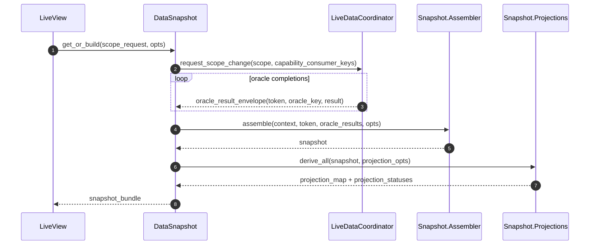
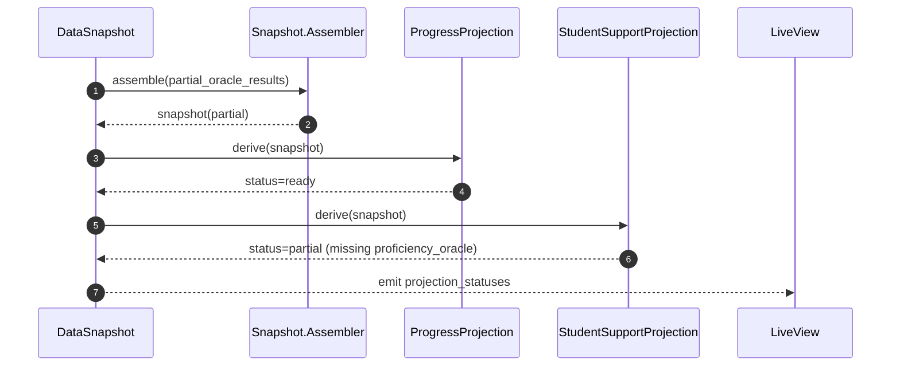

# Data Snapshot FDD

Last updated: 2026-02-17
Feature: `data_snapshot`
Epic: `MER-5198`
Primary Jira: `MER-5304`

## 1. Executive Summary

This feature implements the canonical snapshot and projection layer for Intelligent Dashboard and establishes it as the single semantic source for both UI and CSV consumers. The design separates orchestration concerns from transformation concerns through clear module boundaries: `DataSnapshot` orchestrates retrieval, `Snapshot.Assembler` composes canonical contracts, projection modules derive capability views, and `CsvExport` performs transform-only serialization. Snapshot construction is deterministic and token/scoped so it can safely consume results from cache-hit and runtime-loaded oracle flows. Projection readiness and failure states are explicit and machine-readable, enabling incremental tile hydration and deterministic export handling. CSV generation uses dataset registry mappings that reference projection contracts instead of ad-hoc query logic. The design includes parity metadata/fingerprints so UI and export consistency can be verified operationally and in tests. This layer intentionally does not own queue/token stale suppression or cache policy behavior; those remain in coordinator/cache features. Exact concrete instructor oracle implementations remain tile-driven; this layer is intentionally agnostic and consumes active oracle contracts/bindings. Risks center on projection contract churn and partial-export policy ambiguity, mitigated by capability-scoped projection modules, versioning, and explicit dataset inclusion rules.

## 2. Requirements & Assumptions

Functional requirements (PRD mapping):
- FR-001, FR-002: deterministic snapshot contract with metadata, oracle map, and projection map.
- FR-003, FR-004: capability projection interfaces and readiness statuses.
- FR-005, FR-011: `DataSnapshot` orchestration API with strict boundaries to coordinator/cache/oracle layers.
- FR-006, FR-007, FR-009: CSV transform-only generation via dataset registry and serializers.
- FR-008: deterministic inclusion/failure policy for partial projections.
- FR-010, FR-012: contract versioning and parity fingerprint instrumentation.
- FR-013: extensive unit testing with mocked/stubbed concrete dependencies for snapshot boundary interaction coverage.

Non-functional targets:
- Snapshot assembly p95 <= 700ms.
- Projection derivation p95 <= 300ms.
- CSV ZIP generation p95 <= 5s.
- Zero parity mismatches for gated metrics.

Explicit assumptions:
- Oracle result envelopes from prior lane stories are stable and include version/context identity metadata.
- Coordinator/cache provide deterministic cache-hit/miss and stale-suppression behavior before snapshot assembly.
- Export transport mechanism can consume zip binary + manifest outputs from internal adapters.
- Exact concrete instructor oracle keys/modules are finalized in tile implementation stories and exposed through stable oracle contracts.

Assumption risks:
- If oracle envelopes vary unexpectedly, projection adapters may require normalization shim layers.
- If product policy on partial export is unresolved, rollout may require temporary fail-closed fallback.

## 3. Torus Context Summary

What we know:
- `docs/epics/intelligent_dashboard/data_snapshot/prd.md` defines canonical snapshot intent and CSV reuse path.
- Upgraded lane docs now define explicit boundaries:
  - `data_oracles`: query/contract and dependency planning layer.
  - `data_coordinator`: queue/token orchestration and cache integration layer.
  - `data_cache`: storage policy layer with read-through APIs.
- Existing Torus code contains many CSV download patterns and utility ZIP helpers (for example `Oli.Utils.zip/2`), which can be reused by export adapters.
- No current `Oli.Dashboard.Snapshot.*` implementation exists, so this is greenfield design in lane scope.
- Prototype snapshot and projection path already exercises core contract expectations:
  - Snapshot stores `scope`, `oracle_payloads`, `oracle_statuses`, `projections`, `projection_statuses` (`lib/oli/instructor_dashboard/prototype/snapshot.ex`).
  - `project/4` supports projection assembly from externally provided oracle payloads/statuses, separate from loading.
  - Tile data modules own joins/categorization and axis logic, not UI components (`lib/oli/instructor_dashboard/prototype/tiles/*/data.ex`).

Unknowns to confirm:
- Final endpoint/LiveView integration point for `MER-5266` export initiation with this contract.
- Final product decision for partial export behavior (partial zip + manifest vs fail-closed in all failure cases).

## 4. Proposed Design

### 4.1 Component Roles & Interactions

Shared modules (`Oli.Dashboard.*`):

| Module | Responsibility | Public functions |
|---|---|---|
| `Oli.Dashboard.Snapshot.Contract` | Typed snapshot and projection structs, status enums, version fields. | `new_snapshot/1`, `new_projection_status/1` |
| `Oli.Dashboard.Snapshot.Assembler` | Build canonical snapshot from oracle result envelopes; no queries. Must support projection from externally supplied oracle payload/status maps (prototype `project/4` pattern). | `assemble/4`, `merge_oracle_results/2` |
| `Oli.Dashboard.Snapshot.Projections` | Derive capability projections from canonical snapshot. | `derive_all/2`, `derive/3` |
| `Oli.Dashboard.Snapshot.Parity` | Compute projection/export parity fingerprints and comparisons. | `fingerprint/2`, `compare/2` |

Instructor-specialized modules (`Oli.InstructorDashboard.*`):

| Module | Responsibility | Public functions |
|---|---|---|
| `Oli.InstructorDashboard.DataSnapshot` | Orchestration API; requests scoped data via coordinator path and returns snapshot bundle. | `get_or_build/2`, `get_projection/3` |
| `Oli.InstructorDashboard.DataSnapshot.Projections.*` | Capability projection implementations for instructor semantics. | `derive/2` per capability |
| `Oli.InstructorDashboard.DataSnapshot.DatasetRegistry` | Maps export profile -> datasets -> required projections/serializers. | `datasets_for/1`, `dataset_spec/1` |
| `Oli.InstructorDashboard.DataSnapshot.CsvExport` | Builds CSV rows and ZIP output from snapshot/projection bundle. | `build_zip/2`, `serialize_dataset/3` |

Boundary rules:
- `DataSnapshot` may use coordinator/cache APIs; assembler/projection/export modules remain queryless.
- `CsvExport` cannot call oracles, runtime, coordinator, or analytics query modules directly.
- Projection modules consume snapshot contracts only.
- Global `scope.filters` must be available to projection modules to support parameterized thresholds and rule-based categorization.

### 4.2 State & Message Flow

Snapshot assembly with mixed cache/runtime oracle results:



Incremental projection hydration behavior:



Export reuse path and deterministic policy:

```mermaid
sequenceDiagram
    autonumber
    participant U as Instructor
    participant EXP as CsvExport
    participant REG as DatasetRegistry
    participant IDS as DataSnapshot
    participant PAR as Snapshot.Parity

    U->>EXP: export(scope_request, profile)
    EXP->>IDS: get_or_build(scope_request, for: :csv_export)
    IDS-->>EXP: snapshot_bundle
    EXP->>REG: datasets_for(profile)
    loop each dataset
      EXP->>EXP: check required projection statuses
      alt ready or allowed partial
        EXP->>EXP: serialize_dataset(dataset_spec)
      else required projection failed
        EXP-->>U: deterministic export failure (reason code)
      end
    end
    EXP->>PAR: fingerprint(snapshot_bundle, datasets)
    PAR-->>EXP: parity metadata
    EXP-->>U: zip + manifest
```

### 4.3 Supervision & Lifecycle

- No dedicated long-lived snapshot process required in baseline.
- Assembly/projection/export run in request/task contexts driven by coordinator/integration layers.
- Snapshot bundles are ephemeral and scoped to current request token/scope.
- On session teardown, any unconsumed snapshot artifacts are discarded.

### 4.4 Alternatives Considered

- Separate export query pipeline.
  - Rejected due to semantic drift and duplicate maintenance.
- Tile-owned projection logic.
  - Rejected due to inconsistent contracts and no central parity verification.
- Snapshot as persistence-first datastore table.
  - Rejected for baseline due to complexity and freshness ambiguity; in-memory contract is sufficient now.

Prototype alignment:
- Keep snapshot tile-agnostic and dependency-aware; projection modules evaluate tile semantics.
- Preserve projection status map as first-class output for incremental readiness and export policy decisions.

## 5. Interfaces

### 5.1 HTTP/JSON APIs

No new external HTTP APIs required in this slice.

Potential integration contract for export caller (internal):
- input: scope request + export profile
- output: `{:ok, zip_binary, manifest}` or deterministic error envelope

### 5.2 LiveView

LiveView interaction pattern:
- Calls `DataSnapshot.get_or_build/2` for current scope/capability set.
- Consumes `projection_statuses` for incremental rendering decisions.
- Renders projection-level failure/partial states without bypass queries.

Assigns surfaced (notional):
- `snapshot_meta`
- `projection_map`
- `projection_statuses`
- `parity_fingerprint` (optional debug/ops visibility)

### 5.3 Processes

Notional signatures:

```elixir
assemble(context, request_token, oracle_results, opts) ::
  {:ok, snapshot()} | {:error, {:snapshot_assembly_failed, term()}}

derive_all(snapshot, opts) ::
  {:ok, %{projections: map(), statuses: map()}} | {:error, {:projection_failed, term()}}

get_or_build(scope_request, opts) ::
  {:ok, snapshot_bundle()} | {:error, term()}

build_zip(snapshot_bundle, export_request) ::
  {:ok, binary(), manifest()} | {:error, {:export_failed, reason_code(), term()}}
```

Dataset spec shape (notional):
- `dataset_id`
- `filename`
- `required_projections`
- `optional_projections`
- `serializer_module`
- `failure_policy` (`:fail_closed` | `:allow_partial_with_manifest`)

## 6. Data Model & Storage

### 6.1 Ecto Schemas

None.

### 6.2 Query Performance

Snapshot layer performs no direct analytics queries.

Hot operations:
- merging oracle envelopes,
- projection derivation,
- CSV row serialization,
- zip creation.

## 7. Consistency & Transactions

- Consistency is contract-level and scope-token-bound.
- Snapshot bundle includes request token and scope identity to avoid cross-scope misuse.
- No DB transaction boundaries are introduced.
- Projection status and export policy ensure deterministic behavior under partial oracle readiness.

## 8. Caching Strategy

Snapshot layer caching posture:
- Uses coordinator/cache read-through path indirectly via `DataSnapshot` orchestration.
- Does not implement cache keying/TTL/eviction policy itself.
- May expose optional memoization within request scope only (ephemeral) for repeated projection derivation.

## 9. Performance and Scalability Plan

### 9.1 Budgets

- Snapshot assembly p95 <= 700ms.
- Projection derivation p95 <= 300ms.
- CSV ZIP generation p95 <= 5s.
- Projection status computation overhead p95 <= 50ms.

### 9.2 Hotspots & Mitigations

- Hotspot: large projection maps for large sections.
  - Mitigation: capability-scoped derivation and lazy serializer loading.
- Hotspot: repeated export with unchanged scope.
  - Mitigation: rely on upstream cache-hit path; avoid re-querying.
- Hotspot: zip memory pressure with large datasets.
  - Mitigation: bounded dataset set and streaming/chunked serializer approach if needed.

## 10. Failure Modes & Resilience

| Failure mode | Detection | Handling |
|---|---|---|
| Missing required oracle payload for projection | projection dependency check | set projection status `failed` with reason code |
| Projection derivation error | projection module exception/error tuple | isolate failed capability, keep others available when policy allows |
| Export required dataset projection unavailable | dataset policy check | deterministic fail-closed export error with reason code |
| CSV serializer error for one dataset | serializer failure | apply dataset policy (`fail_closed` or `allow_partial_with_manifest`) |
| ZIP generation error | zip utility error | return `export_failed` and preserve service health |

## 11. Observability

Telemetry events (proposed):
- `[:oli, :dashboard, :snapshot, :assembly, :stop]`
- `[:oli, :dashboard, :snapshot, :projection, :stop]`
- `[:oli, :dashboard, :snapshot, :projection, :status]`
- `[:oli, :dashboard, :snapshot, :export, :stop]`
- `[:oli, :dashboard, :snapshot, :parity, :check]`

Metadata:
- `dashboard_product`
- `scope_container_type`
- `capability_key`
- `status` (`ready`, `partial`, `failed`, `unavailable`)
- `export_profile`
- `reason_code` for failures

## 12. Security & Privacy

- Snapshot/projection contracts include only authorized scope data.
- Export adapters must not include hidden/internal-only fields not represented in approved projection contracts.
- Telemetry excludes raw student PII payload values.
- Manifest and parity metadata include identifiers/status only.

## 13. Testing Strategy

Unit tests:
- deterministic snapshot assembly shape and metadata
- projection module derivations and status mapping
- dataset registry and serializer behavior
- mocked/stubbed concrete dependencies (oracle-result producers, coordinator/cache facades, serializer adapters) where needed to exercise end-to-end snapshot component interactions at boundaries

Integration tests:
- `DataSnapshot.get_or_build/2` with mixed cache/runtime oracle results
- UI/CSV parity on representative scopes and capability sets
- deterministic export behavior for partial/failure policies

Regression tests:
- no direct query/oracle calls inside `CsvExport` adapters
- versioned contract compatibility checks for projection consumers

## 14. Backwards Compatibility

- Additive internal architecture.
- Existing consumers can migrate projection-by-projection to snapshot contracts.
- Export path can be switched after parity gate passes.
- No end-user API/schema break introduced.

## 15. Risks & Mitigations

- Risk: capability projection definitions diverge from product semantics.
  - Mitigation: product-reviewed projection contracts and parity suite.
- Risk: unresolved partial-export policy causes inconsistent behavior.
  - Mitigation: enforce explicit dataset-level failure policy config and one default.
- Risk: snapshot layer starts owning runtime/cache policy logic.
  - Mitigation: boundary checks in PRD/FDD and code review gates.

## 16. Open Questions & Follow-ups

- Which default export policy should v1 use when a non-critical dataset fails: fail-closed or partial-with-manifest?
- Should parity checks run synchronously on export path or asynchronously sampled in baseline?

## 17. Decision Log

### 2026-02-17 - Align Snapshot FDD With Prototype Projection Boundary
- Change: Added explicit `project/4`-style externally supplied projection path and scope-filter propagation requirement for projection modules.
- Reason: Prototype demonstrated that separating load orchestration from projection assembly improves incremental updates and reuse across controller paths.
- Evidence: `lib/oli/instructor_dashboard/prototype/snapshot.ex`, `lib/oli/instructor_dashboard/prototype/tiles/progress/data.ex`, `lib/oli/instructor_dashboard/prototype/tiles/student_support/data.ex`
- Impact: Clarifies `FR-001`/`FR-004`/`FR-011` boundaries and strengthens deterministic projection-status behavior.

## 18. References

- `docs/epics/intelligent_dashboard/data_snapshot/prd.md`
- `docs/epics/intelligent_dashboard/edd.md`
- `docs/epics/intelligent_dashboard/data_oracles/prd.md`
- `docs/epics/intelligent_dashboard/data_coordinator/prd.md`
- `docs/epics/intelligent_dashboard/data_cache/prd.md`
- `lib/oli/utils.ex`
- `lib/oli/instructor_dashboard/prototype/snapshot.ex`
- `lib/oli/instructor_dashboard/prototype/tiles/progress/data.ex`
- `lib/oli/instructor_dashboard/prototype/tiles/student_support/data.ex`
