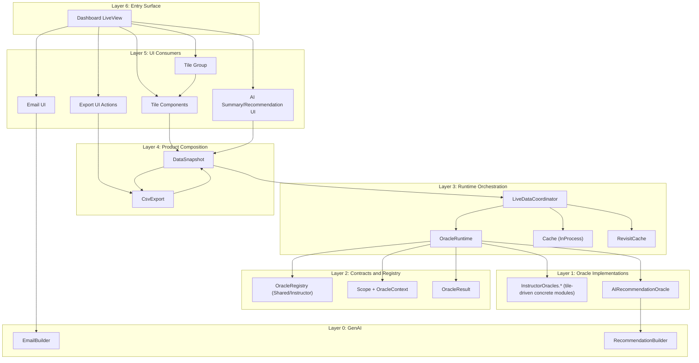
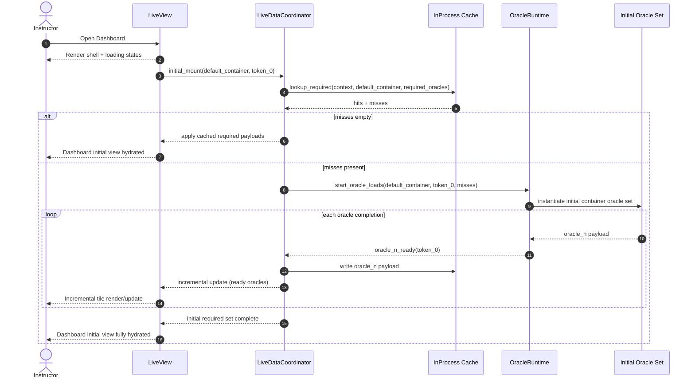
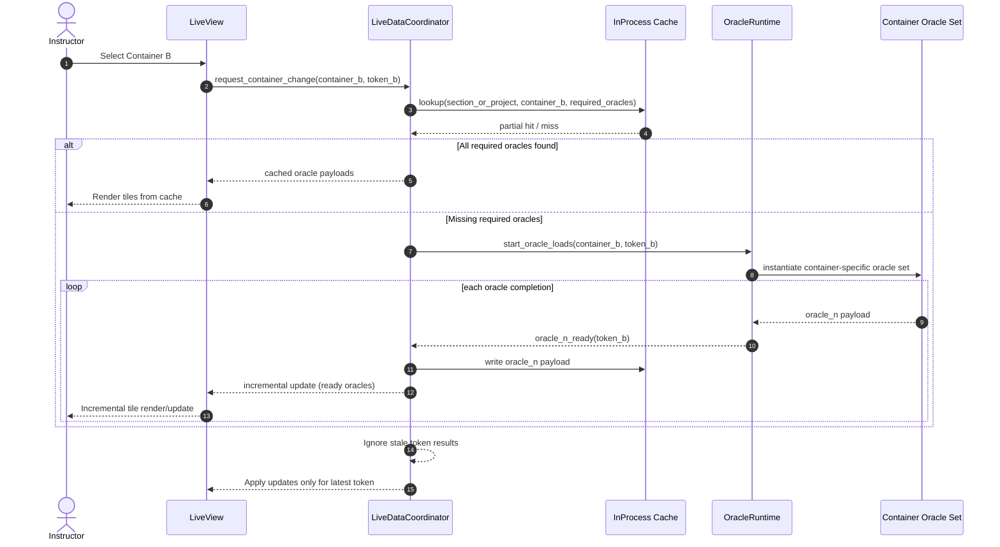
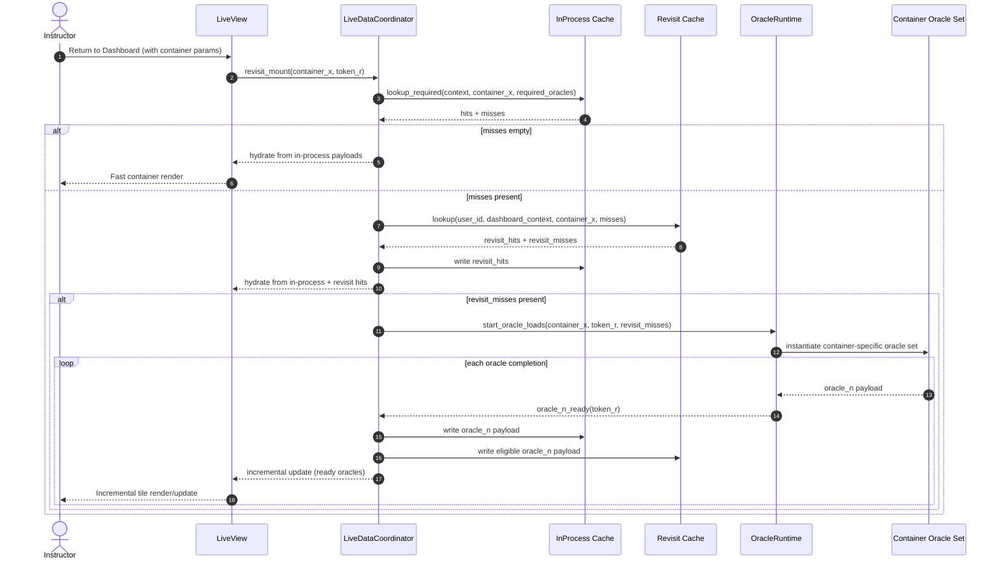

# Instructor Intelligent Dashboard - Epic Design Document (EDD)

Last updated: 2026-02-17

This Epic Design Document (EDD) defines the high-level architecture for delivering the Instructor Intelligent Dashboard epic (`MER-5198`) and explains how dashboard infrastructure, oracles, caches, tiles, AI capabilities, and exports fit together.

Detailed subsystem design for data/oracle/caching internals is maintained in the `data_oracles`, `data_coordinator`, `data_cache`, and `data_snapshot` feature packs under `docs/epics/intelligent_dashboard/`.

## Definition of Terms

- `Dashboard`: The instructor-facing Insights surface introduced by this epic, including summary, tiles, AI workflows, and export actions (`MER-5246`, `MER-5248`, `MER-5266`).
- `Scope`: The active data scope selected by the instructor (for example `Entire Course`, `Unit`, `Module`). Scope changes should update all relevant dashboard surfaces consistently (`MER-5248`).
- `Container`: A scope unit in the course structure (course/unit/module/etc.) used for filtering and cache partitioning (`MER-5248`).
- `Tile Group`: A visual grouping area for tiles in the UI (for example `Engagement` and `Content`), distinct from scope containers (`MER-5258`).
- `Tile`: A focused dashboard UI component that renders one functional slice of insight/action. Examples in this epic: Progress (`MER-5251`), Student Support (`MER-5252`), Challenging Objectives (`MER-5253`), Assessments (`MER-5254`), and Summary+AI Recommendation (`MER-5249`).
- `Oracle`: A reusable domain data source contract (for example students/progress/proficiency/assessments/ai-recommendation) that loads and exposes normalized data independent of any single tile implementation. Tiles consume oracles; tiles do not run direct analytics queries.
- `Capability Consumer`: A reusable consumer key that declares required/optional oracle dependencies; multiple tiles may consume the same capability consumer.
- `Snapshot`: A scoped assembled data object composed from oracle outputs, plus derived projections used by multiple consumers (tiles, AI features, CSV export path).
- `Projection`: A consumer-oriented view derived from snapshot/oracle data for specific presentation or workflow needs (for example a chart-ready series, a student list view, or AI context block).
- `Incremental Hydration`: Rendering strategy where the dashboard shell appears first, then tiles populate as their dependencies resolve asynchronously, instead of waiting for all data before first meaningful render.
- `LiveDataCoordinator`: The runtime controller that handles async load orchestration, in-flight/queued request policy, stale-result suppression, and deterministic timeout fallback during fast scope changes.
- `InProcess Cache`: LiveView-local oracle cache used for fast interaction within the current dashboard session.
- `Revisit Cache`: Short-lived node-wide per-user cache used only for parameterized return/revisit flows (for example drilling into a student then navigating back).
- `AI Recommendation`: AI-generated guidance shown in the Summary tile, with feedback and regeneration capabilities (`MER-5249`, `MER-5250`).
- `AI Email Workflow`: Context-aware AI drafting and sending flow for outreach, sourced from shared dashboard context rather than isolated logic (`MER-5257`).

## Architectural Intent

- Introduce a reusable framework for analytics dashboards that can be adopted elsewhere in the future.
- Keep product-specific composition isolated from shared runtime concerns.
- Support asynchronous, incremental rendering so UI is responsive before all data arrives.
- Protect backend workload and UI stability by throttling DB calls during rapid UI changes.
- Use layered caching to improve perceived performance and reduce redundant recomputation while maintaining deterministic freshness behavior.
- Make AI and non-AI tile features first-class consumers of the same oracle/snapshot system.
- Make CSV export a transform over shared dashboard data, not an independent query path.

## Layered Architecture View

## High-Level Architecture

### 1) Shared Dashboard Infrastructure (`Oli.Dashboard.*`)

This is the reusable foundation for current and future dashboards:

- Scope model and container resolution
- Oracle contract
- Oracle runtime and dependency-aware async loading
- Reusable oracle contracts, registries, and result envelope types
- Live data coordination (in-flight/queued request policy)
- Snapshot assembly and projection
- In-process cache and revisit cache

### 2) Instructor Dashboard Composition (`Oli.InstructorDashboard.*`)

This is the product-specific layer:

- Instructor dashboard snapshot API and oracle selection
- Instructor capability-to-oracle bindings and registries
- Exact concrete instructor oracle modules/keys are tile-driven and finalized in tile implementation stories
- Tile composition mapped to capability-consumer dependency declarations
- Instructor-specific CSV export mapping
- Instructor-specific UI actions and navigation paths

### 3) Dashboard UI Integration and Components (`OliWeb.*`)

This is the integration/glue layer that connects UI runtime behavior to shared dashboard services:

- LiveView integration code that wires `Oli.Dashboard.*` and `Oli.InstructorDashboard.*` into mount, params, events, and async updates.
- UI state orchestration for loading, partial render, error, and stale-result suppression behaviors.
- UX component implementations for tile UI, controls, interactions, and drill-through actions.
- Shared UI utilities for dependency-driven tile hydration and cross-tile state coordination.
- Vega-Lite visualization implementations and wrappers for tiles that require chart-driven analytics views.

### 4) Capability Consumption Model (Tiles as Consumers)

Tiles do not query storage directly.

- Tiles map to capability-consumer keys defined in instructor registry contracts.
- Capability-consumer keys declare required and optional oracle dependencies.
- Multiple tiles may consume the same capability-consumer key.
- Tiles render incrementally as required dependency data becomes available.
- Partial render is allowed when optional oracle data is pending.

## Oracle-Centric Design

The dashboard runtime is oracle-first. Oracles are the sole data boundary between UI/tile code and underlying storage/query engines.

### What an Oracle Encapsulates

- Query definition and execution strategy for one domain (for example `progress_oracle`, `proficiency_oracle`, `assessment_oracle`).
- Source-of-truth selection logic (which datastore(s) to query and when).
- Input scope handling (`section`, `container`, thresholds/options).
- Data normalization into stable payload contracts consumed by tiles/snapshots.
- Prerequisite dependency declaration metadata used by runtime planning and staged execution.
- Optional helper/projection functions for downstream consumers.

UI code and tile components must not bypass this boundary with direct SQL/analytics queries.
Oracle modules also do not call peer oracle modules directly; prerequisite payloads are injected by runtime/orchestration layers.

### Data Source Strategy per Oracle

An oracle may use one datastore or multiple datastores, depending on domain needs:

- Main transactional database (Postgres/Ecto):
  - entity lookups, metadata joins, permissions-scoped records, canonical relational state.
- OLAP analytics store (ClickHouse):
  - high-cardinality aggregates, distributions, and performance-sensitive analytical slices.
- Hybrid oracle (Postgres + ClickHouse):
  - uses ClickHouse for aggregate metrics and Postgres for enriching entity/context details.

This choice is oracle-specific and intentionally hidden behind the oracle contract.

### Why This Matters

- Keeps tile implementations simple and query-agnostic.
- Prevents drift into ad-hoc per-tile query paths.
- Allows datastore strategy changes (for example moving an aggregate from Postgres to ClickHouse) without rewriting UI flows.
- Ensures AI features (recommendation + email context) and non-AI tiles consume the same normalized backbone.

In short: every major data domain is exposed via oracles, AI recommendation is treated as an oracle consumer/output path, and AI email context is derived from shared oracle/snapshot state.

## Runtime Behavior (High-Level)

### Initial Mount

- Render dashboard shell immediately.
- Resolve required dependencies for visible capability consumers.
- Consult `InProcess` cache via cache API; on true first mount this typically yields misses.
- Base mount without explicit container params does not consult `Revisit Cache`.
- Fetch missing oracle data asynchronously.
- Render tiles incrementally as oracle dependencies resolve.

### Container Changes

- Apply one in-flight + one queued request control to throttle clients.
- InProcess cache is utilized through cache API.
- Replace queued request with latest user intent under rapid toggling.
- Suppress stale async results with request token checks.
- If active load exceeds configured timeout, emit deterministic scoped fallback state/events and keep coordinator responsive for the next request.

### Revisit Flow

- On parameterized return navigation (like to a specific scope), first consult `InProcess Cache`.
- If required dependencies are still missing and the flow is revisit-eligible, consult short-lived per-user `Revisit Cache`.
- If still missing, continue normal build/load path.

## Cache Model (Conceptual)

- `InProcess Cache`: primary per-LiveView runtime cache for oracle payloads by container.
- `Revisit Cache`: short-lived node-wide per-user cache for eligible explicit-container revisit flows, keyed by user/context/container/oracle identity.
- Capacity controls are container-count based (not oracle-count based).
- Freshness is TTL-driven; detailed policy is defined in `data_cache` PRD/FDD.

## Extensibility Posture

The design is intended to support future dashboards and new tiles.

- New dashboard products should compose on `Oli.Dashboard.*`.
- New tiles should consume projection contracts and map to capability-consumer keys.
- New AI surfaces should plug into the same oracle/snapshot ecosystem.
- Shared runtime contracts should evolve via versioned interfaces.

## Document Boundaries

- `overview.md`: brief epic scope and ticket index.
- `prd.md`: epic product requirements and acceptance targets.
- `edd.md` (this document): high-level architecture and system fit.
- `data_oracles/*`, `data_coordinator/*`, `data_cache/*`, `data_snapshot/*`: subsystem-level design for data/oracles/orchestration/caching/snapshot.
- `plan.md`: phased execution and development sequencing.
