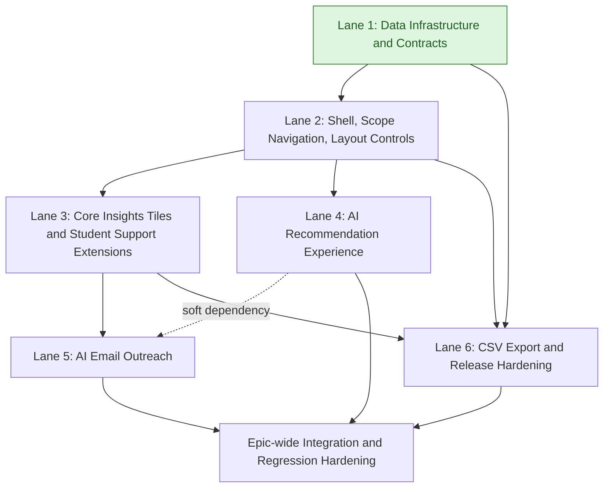

# Instructor Intelligent Dashboard — High-Level Development Plan

Last updated: 2026-02-16

Context references:
- Epic overview: `docs/epics/intelligent_dashboard/overview.md`
- Epic PRD: `docs/epics/intelligent_dashboard/prd.md`
- Epic EDD: `docs/epics/intelligent_dashboard/edd.md`
- Data workstream design: `docs/epics/intelligent_dashboard/data_oracles/prd.md`, `docs/epics/intelligent_dashboard/data_coordinator/prd.md`, `docs/epics/intelligent_dashboard/data_cache/prd.md`, `docs/epics/intelligent_dashboard/data_snapshot/prd.md`, `docs/epics/intelligent_dashboard/concrete_oracles/README.md`
- Lane 1 feature tracks:
  - `docs/epics/intelligent_dashboard/data_oracles/prd.md`
  - `docs/epics/intelligent_dashboard/data_oracles/fdd.md`
  - `docs/epics/intelligent_dashboard/data_coordinator/prd.md`
  - `docs/epics/intelligent_dashboard/data_coordinator/fdd.md`
  - `docs/epics/intelligent_dashboard/data_cache/prd.md`
  - `docs/epics/intelligent_dashboard/data_cache/fdd.md`
  - `docs/epics/intelligent_dashboard/data_snapshot/prd.md`
  - `docs/epics/intelligent_dashboard/data_snapshot/fdd.md`
  - `docs/epics/intelligent_dashboard/concrete_oracles/README.md`
- Lane-structured reference format: `docs/epics/adaptive_page_improvements/plan.md`

## Why We Are Organizing By Lanes

Lanes group tightly related work so teams can execute in coherent streams with explicit dependency boundaries. This reduces context switching, prevents hidden sequencing conflicts, and makes immediate-start work visible.

## Lane Summary

- Lane 1: Data Infrastructure and Contracts
  - Builds the shared oracle/snapshot/cache/runtime backbone in `Oli.Dashboard.*` and `Oli.InstructorDashboard.DataSnapshot.*`.
- Lane 2: Dashboard Shell, Scope Navigation, and Layout Controls
  - Delivers dashboard entry/default behavior, global container filtering, grouping containers, and tile expansion/reflow controls.
- Lane 3: Core Insights Tiles and Student Support Extensions
  - Delivers progress, student support, challenging objectives, assessments, plus student profile hover and support-parameter customization.
- Lane 4: AI Recommendation Experience
  - Delivers AI recommendation infrastructure first, then summary/UI recommendation interactions, feedback capture, and regeneration.
- Lane 5: AI Email Outreach
  - Delivers context-aware AI draft email generation and send workflows from supported dashboard entry points.
- Lane 6: CSV Export and Release Hardening
  - Delivers scoped CSV ZIP export from shared snapshot data and closes performance/reliability/a11y hardening gates.

## Clarifications and Assumptions

- This plan is intentionally high-level and lane-oriented.
- Jira scope and story descriptions were revalidated from Jira on 2026-02-16 for epic `MER-5198` and children:
  - `MER-5246`, `MER-5248`, `MER-5249`, `MER-5250`, `MER-5251`, `MER-5252`, `MER-5253`, `MER-5254`, `MER-5255`, `MER-5256`, `MER-5257`, `MER-5258`, `MER-5259`, `MER-5266`, `MER-5310`.
- `MER-5218` (Instructor AI Recommendations POC) is treated as discovery input/reference, not primary delivery scope.
- Serial order inside each lane is dependency-first, then risk reduction, then workflow completion.
- Lane dependencies are lane-level by default; ticket-level constraints are called out when needed.

## Lane 1: Data Infrastructure and Contracts

### Scope
- `MER-5301` Data Infra: Scope/Oracle Contracts and Registry (`data_oracles`)
  - `docs/epics/intelligent_dashboard/data_oracles/prd.md`
  - `docs/epics/intelligent_dashboard/data_oracles/fdd.md`
- `MER-5302` Data Infra: Live Data Coordinator and Request Control (`data_coordinator`)
  - `docs/epics/intelligent_dashboard/data_coordinator/prd.md`
  - `docs/epics/intelligent_dashboard/data_coordinator/fdd.md`
- `MER-5303` Data Infra: InProcess/Revisit Cache and Tiered Limits (`data_cache`)
  - `docs/epics/intelligent_dashboard/data_cache/prd.md`
  - `docs/epics/intelligent_dashboard/data_cache/fdd.md`
- `MER-5304` Data Infra: Snapshot Assembler and CSV Reuse Contract (`data_snapshot`)
  - `docs/epics/intelligent_dashboard/data_snapshot/prd.md`
  - `docs/epics/intelligent_dashboard/data_snapshot/fdd.md`
- `MER-5310` Technical Story: Concrete Oracle Implementations (`concrete_oracles`)
  - `docs/epics/intelligent_dashboard/concrete_oracles/README.md`
- Enabling stories that consume this lane:
  - `MER-5248` Global Filter Navigation Learning Dashboard
  - `MER-5266` Intelligent Dashboard CSV Download

### Proposed Serial Order
1. `MER-5301` Data Infra: Scope/Oracle Contracts and Registry
2. `MER-5302` Data Infra: Live Data Coordinator and Request Control
3. `MER-5303` Data Infra: InProcess/Revisit Cache and Tiered Limits
4. `MER-5304` Data Infra: Snapshot Assembler and CSV Reuse Contract
5. `MER-5310` Technical Story: Concrete Oracle Implementations

### Dependency Notes
- `MER-5248` requires deterministic scope/filter runtime and cache behavior, which are Lane 1 concerns.
- `MER-5266` requires export from the same scoped snapshot model (no independent analytics query path), also a Lane 1 concern.
- `MER-5301` to `MER-5304` establish the explicit infra sequence that unblocks `MER-5248` and export consistency for `MER-5266`.
- Keeping this lane first prevents tile-level or AI-level direct query accretion that conflicts with PRD/EDD architecture.

### Cross-Lane Dependencies
- No inbound lane dependency; this lane can start immediately.
- Lanes 2, 3, 4, 5, and 6 depend on Lane 1.

## Lane 2: Dashboard Shell, Scope Navigation, and Layout Controls

### Scope
- `MER-5246` Insights > Learning Dashboard
- `MER-5248` Global Filter Navigation Learning Dashboard
- `MER-5258` Engagement & Content Containers
- `MER-5259` Expandable Tiles

### Proposed Serial Order
1. `MER-5246` Insights > Learning Dashboard
2. `MER-5248` Global Filter Navigation Learning Dashboard
3. `MER-5258` Engagement & Content Containers
4. `MER-5259` Expandable Tiles

### Dependency Notes
- `MER-5246` establishes the instructor landing/entry shell used by all downstream tile and AI workflows.
- `MER-5248` defines global scope selection/navigation behavior that all tiles and AI features must respect.
- `MER-5258` and `MER-5259` are presentation/layout controls that should follow stable shell/filter semantics to avoid repeated UI state churn.

### Cross-Lane Dependencies
- Hard dependency on completion of Lane 1.
- Lane 3 and Lane 4 depend on completion of Lane 2.

## Lane 3: Core Insights Tiles and Student Support Extensions

### Scope
- `MER-5251` Progress Tile
- `MER-5252` Student Support Tile
- `MER-5253` Challenging Objectives Tile
- `MER-5254` Assessments Tile
- `MER-5255` View Students Profile on Hover Student Support Tile
- `MER-5256` Customizing Student Support Parameters

### Proposed Serial Order
1. `MER-5251` Progress Tile
2. `MER-5252` Student Support Tile
3. `MER-5253` Challenging Objectives Tile
4. `MER-5254` Assessments Tile
5. `MER-5255` View Students Profile on Hover Student Support Tile
6. `MER-5256` Customizing Student Support Parameters

### Dependency Notes
- `MER-5255` and `MER-5256` are explicit extensions of Student Support behavior and should follow `MER-5252`.
- Progress/objectives/assessments/support tiles all rely on the same scoped snapshot/oracle model and should be sequenced after stable Lane 2 scope/filter behavior.

### Cross-Lane Dependencies
- Hard dependency on completion of Lanes 1 and 2.
- Lane 5 depends on completion of Lane 3.

## Lane 4: AI Recommendation Experience

### Scope
- `MER-5305` AI Infra: Recommendation Pipeline and Contracts
- `MER-5249` Summary Tile & AI Recommendation
- `MER-5250` AI Recommendations Feedback & Regeneration

### Proposed Serial Order
1. `MER-5305` AI Infra: Recommendation Pipeline and Contracts
2. `MER-5249` Summary Tile & AI Recommendation
3. `MER-5250` AI Recommendations Feedback & Regeneration

### Dependency Notes
- AI recommendation infrastructure must land first so UI work is built on stable context and generation contracts.
- `MER-5249` establishes the baseline recommendation surface and summary tile context on top of that infrastructure.
- `MER-5250` is an interaction refinement layer (feedback/regeneration) that should follow stable recommendation generation/display behavior.
- AI recommendation quality depends on normalized context derived from Lane 1 contracts and Lane 2 scope selection.

### Cross-Lane Dependencies
- Hard dependency on completion of Lanes 1 and 2.
- Lane 5 has a soft dependency on Lane 4 for shared AI interaction patterns and prompt/context consistency.

## Lane 5: AI Email Outreach

### Scope
- `MER-5257` AI Email Capabilities & updates

### Proposed Serial Order
1. `MER-5257` AI Email Capabilities & updates

### Dependency Notes
- Jira scope requires context-aware drafting from supported initiation points including student/assessment workflows, so Lane 3 behavior must be stable first.
- Delivery should align with recommendation-era AI context conventions from Lane 4 to reduce divergent prompt/feedback patterns.

### Cross-Lane Dependencies
- Hard dependency on completion of Lanes 1, 2, and 3.
- Soft dependency on completion of Lane 4.

## Lane 6: CSV Export and Release Hardening

### Scope
- `MER-5266` Intelligent Dashboard CSV Download
- Epic-level hardening from PRD NFR and acceptance gates:
  - Performance/reliability verification
  - Accessibility and regression hardening

### Proposed Serial Order
1. `MER-5266` Intelligent Dashboard CSV Download
2. Epic hardening (perf, observability, accessibility, regression gates)

### Dependency Notes
- `MER-5266` depends on mature snapshot contracts and scope semantics from Lanes 1 and 2.
- Export correctness is strongest after core insight tile data contracts are stable (Lane 3), since CSV content should align with on-screen metrics.
- Final hardening must happen after all functional lanes land.

### Cross-Lane Dependencies
- Hard dependency on completion of Lanes 1 and 2.
- `MER-5266` should follow Lane 3 completion.
- Final hardening depends on completion of Lanes 3, 4, and 5.

## Suggested Global Execution Shape

1. Start Lane 1 (Data Infrastructure and Contracts) first.
2. After Lane 1 completes, start Lane 2 (Dashboard Shell, Scope Navigation, and Layout Controls).
3. After Lane 2 completes, run Lane 3 (Core Insights Tiles) and Lane 4 (AI Recommendation Experience) in parallel.
4. After Lane 3 completes, run Lane 5 (AI Email Outreach), while aligning with Lane 4 outcomes.
5. Start Lane 6 (`MER-5266`) after Lanes 1-3 are stable; then run epic-level hardening after all functional lanes complete.

## Lane Dependency Flow (Mermaid)

Note: Light green lane nodes indicate lanes with no inbound dependencies and can be started immediately.
