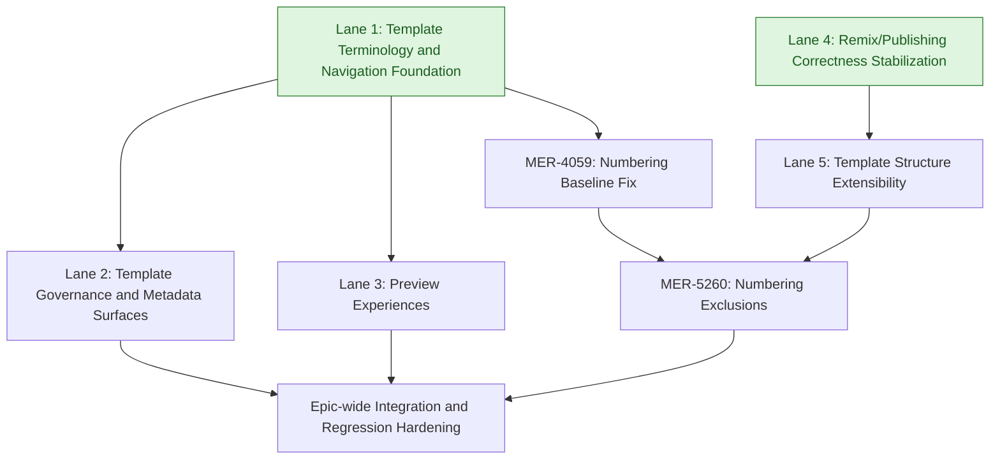

# Product Overhaul — High-Level Development Plan

Context references:
- Epic overview: `docs/epics/product_overhaul/overview.md`
- Epic PRD: `docs/epics/product_overhaul/prd.md`
- Feature tracks:
  - `docs/epics/product_overhaul/template_preview/informal.md`
  - `docs/epics/product_overhaul/template_preview/prd.md`
  - `docs/epics/product_overhaul/template_preview/fdd.md`
  - `docs/epics/product_overhaul/template_preview/plan.md`
  - `docs/epics/product_overhaul/image_preview/informal.md`
  - `docs/epics/product_overhaul/image_preview/prd.md`
  - `docs/epics/product_overhaul/image_preview/fdd.md`
  - `docs/epics/product_overhaul/image_preview/plan.md`
  - `docs/epics/product_overhaul/add_containers/informal.md`

## Why We Are Organizing By Lanes

Lanes group tightly related tickets so implementation can proceed in cohesive streams with lower context switching, clearer ownership boundaries, and explicit sequencing where architectural coupling exists.

## Lane Summary

- Lane 1: Template Terminology and Navigation Foundation
  - Standardizes naming and core overview navigation surfaces that other template UX work builds on.
- Lane 2: Template Governance and Metadata Surfaces
  - Adds defaults, visibility controls, and overview-level operational metadata for template management.
- Lane 3: Preview Experiences
  - Delivers runtime-faithful template preview and cover image preview capabilities in template flows.
- Lane 4: Remix/Publishing Correctness Stabilization
  - Fixes core content-remix correctness before introducing larger structure changes.
- Lane 5: Template Structure Extensibility
  - Introduces template-scoped container creation and revision scoping for future template evolution.
- Lane 6: Curriculum Numbering and Exclusions
  - Stabilizes numbering behavior first, then layers exclusion controls after structural model changes are complete.

## Clarifications and Assumptions

- This plan is intentionally high-level and lane-oriented.
- Ticket scope source is `docs/epics/product_overhaul/overview.md` actionable items list.
- Jira descriptions were retrieved directly via CLI for `MER-4032`, `MER-4048`, `MER-4052`, `MER-4053`, `MER-4054`, `MER-4055`, `MER-4056`, `MER-4057`, `MER-4058`, `MER-4059`, `MER-4061`, `MER-4062`, `MER-4679`, and `MER-5260`.
- Feature tickets with local spec artifacts are treated as source-of-truth for technical direction:
  - `MER-4052` (`image_preview`)
  - `MER-4053` (`template_preview`)
  - `MER-4057` (`add_containers`)
- Serial order inside each lane is dependency-first, then risk reduction, then workflow completion.
- Lane dependencies are primarily lane-level; where ticket-level constraints materially improve flow, they are called out explicitly.

## Lane 1: Template Terminology and Navigation Foundation

### Scope
- MER-4048 Change "Product" to "Templates"
- MER-4679 Product Overview Page Updates
- MER-4058 Breadcrumb leading to wrong page in templates/products

### Proposed Serial Order
1. MER-4048 Change "Product" to "Templates"
2. MER-4679 Product Overview Page Updates
3. MER-4058 Breadcrumb leading to wrong page in templates/products

### Dependency Notes
- MER-4048 provides terminology and label baseline for all later template-overview UI work.
- MER-4679 should land after terminology unification to avoid duplicate copy/label churn.
- MER-4058 closes navigation correctness after overview routing/surface updates are in place.

### Cross-Lane Dependencies
- Lane 2 depends on completion of Lane 1.
- Lane 3 depends on completion of Lane 1.

## Lane 2: Template Governance and Metadata Surfaces

### Scope
- MER-4054 Course Section Defaults
- MER-4056 Ability to restrict products' public access
- MER-4061 Manage Source Materials Badge Template Overview
- MER-4062 View Product/Template Usage

### Proposed Serial Order
1. MER-4054 Course Section Defaults
2. MER-4056 Ability to restrict products' public access
3. MER-4062 View Product/Template Usage
4. MER-4061 Manage Source Materials Badge Template Overview

### Dependency Notes
- MER-4054 and MER-4056 establish core template governance semantics (defaults and access posture).
- MER-4062 should follow governance semantics so usage views reflect final policy/visibility expectations.
- MER-4061 is overview metadata polish and is safest after governance and usage data behaviors settle.

### Cross-Lane Dependencies
- Hard dependency on completion of Lane 1.
- No hard dependency with Lane 3; both can run in parallel after Lane 1.

## Lane 3: Preview Experiences

### Scope
- MER-4053 Template Preview Capabilities
- MER-4052 Cover Image Updates

### Proposed Serial Order
1. MER-4053 Template Preview Capabilities
2. MER-4052 Cover Image Updates

### Dependency Notes
- `MER-4053` (`template_preview`) uses existing delivery/enrollment behavior and establishes preview entry patterns.
- `MER-4052` (`image_preview`) performs wider component extraction/refactoring for runtime-faithful image previews across My Course/Course Picker/Welcome contexts.
- Doing MER-4053 first de-risks preview-action and template-overview integration before broader shared-component extraction.

### Cross-Lane Dependencies
- Hard dependency on completion of Lane 1.
- No hard dependency with Lane 2; both can run in parallel after Lane 1.

## Lane 4: Remix/Publishing Correctness Stabilization

### Scope
- MER-4055 Removing and reintroducing a page does not show

### Proposed Serial Order
1. MER-4055 Removing and reintroducing a page does not show

### Dependency Notes
- This is a correctness baseline for remix/update behavior and should stabilize publication-sensitive paths before structural container-scope expansion.

### Cross-Lane Dependencies
- Can run in parallel with Lane 1.
- Lane 5 depends on completion of Lane 4.

## Lane 5: Template Structure Extensibility

### Scope
- MER-4057 Remixing/Customize Content Updates (`add_containers`)

### Proposed Serial Order
1. MER-4057 Remixing/Customize Content Updates

### Dependency Notes
- `MER-4057` introduces revision `scope` semantics (`project | blueprint | section`) and scope-aware container queries.
- This lane has broad model/query impact and should be isolated after remix/publishing correctness stabilization to reduce debugging overlap.

### Cross-Lane Dependencies
- Hard dependency on completion of Lane 4.
- `MER-5260` in Lane 6 depends on completion of Lane 5.

## Lane 6: Curriculum Numbering and Exclusions

### Scope
- MER-4059 Display curriculum item numbers
- MER-5260 Display curriculum item numbers exclusions

### Proposed Serial Order
1. MER-4059 Display curriculum item numbers
2. MER-5260 Display curriculum item numbers exclusions

### Dependency Notes
- MER-5260 is an extension/refinement of curriculum numbering behavior and follows MER-4059.
- MER-4059 is a direct correctness bug in existing template overview settings and should not wait on container-scope model changes.
- MER-5260 should land after Lane 5 because exclusions interact with unit-level curriculum structure and should align with finalized container-scope behavior.

### Cross-Lane Dependencies
- MER-4059 depends on completion of Lane 1 (template terminology/navigation baseline).
- MER-5260 depends on completion of MER-4059 and Lane 5.

## Suggested Global Execution Shape

1. Start Lane 1 (Template Terminology and Navigation Foundation) and Lane 4 (Remix/Publishing Correctness Stabilization) in parallel.
2. After Lane 1 completes, start Lane 2 (Template Governance and Metadata Surfaces) and Lane 3 (Preview Experiences) in parallel.
3. After Lane 1 completes, start `MER-4059` (Lane 6 baseline numbering fix) in parallel with Lanes 2 and 3.
4. After Lane 4 completes, start Lane 5 (Template Structure Extensibility).
5. After Lane 5 and `MER-4059` complete, implement `MER-5260` (Lane 6 exclusions).
6. Complete remaining open work in Lanes 2 and 3, then run epic-wide integration/regression hardening.

## Lane Dependency Flow (Mermaid)

Note: Light green lane nodes indicate lanes with no inbound dependencies and can be started immediately.

## Decision Log

### 2026-02-16 - Rebased lane dependencies using full Jira descriptions
- Change: Updated assumptions to reflect successful Jira description retrieval, revised Lane 6 dependency model, and adjusted global execution shape so `MER-4059` runs earlier while `MER-5260` remains structurally gated.
- Reason: Ticket descriptions show `MER-4059` is an existing correctness bug ("never disabled even when unchecked"), while `MER-5260` is an additive exclusion refinement better aligned with post-`MER-4057` structure semantics.
- Evidence: `docs/epics/product_overhaul/overview.md`, `docs/epics/product_overhaul/add_containers/informal.md`, and Jira descriptions fetched via `jira issue view <KEY> --raw` for `MER-4059`, `MER-5260`, and related epic tickets.
- Impact: Lane sequencing now reduces delay on high-signal correctness work while preserving dependency safety for exclusion behavior that touches template structure.
